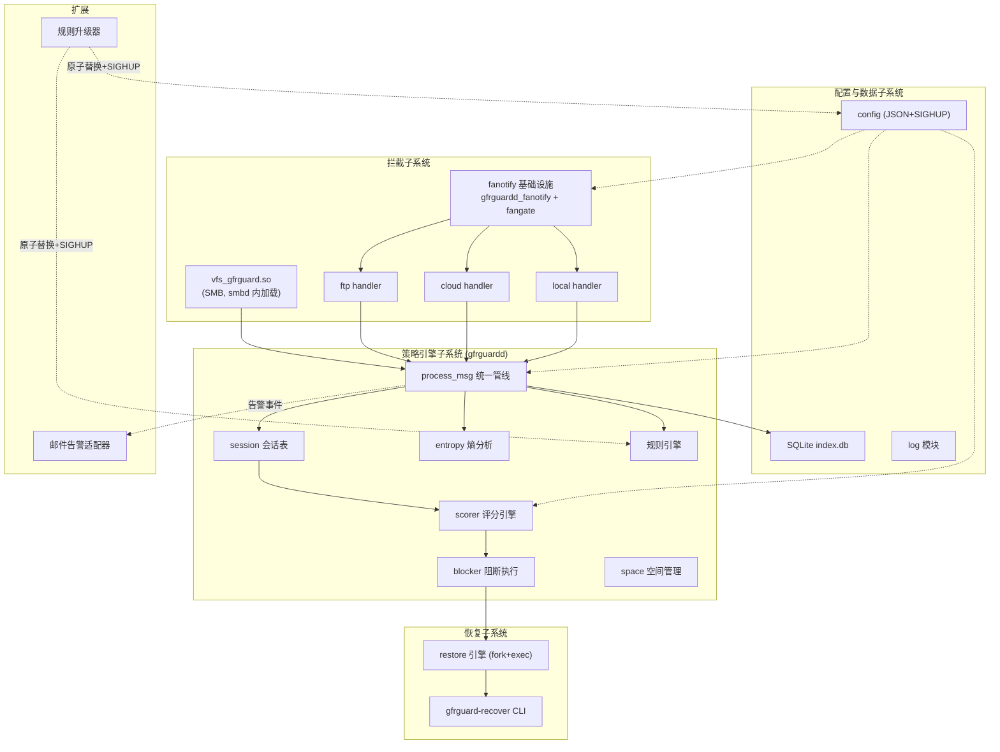

# GF2000 APPCHECK 软件架构文档

| 项目 | 内容 |
|------|------|
| 文档编号 | GF2000_APPCHECK_SA_01 |
| 版本号 | V1.0 |
| 编制日期 | 2026-07-17 |
| 模板 | NSFT_AT02 V2.0（软件架构文档模板） |

## 更改履历

| 版本号 | 更改时间 | 更改的图表和章节号 | 状态 | 更改简要描述 | 更改人 | 批准人 |
|--------|---------|-------------------|------|-------------|--------|--------|
| V1.0 | 2026-07-17 | 全部 | N | 初版：综合需求规格说明书与详细设计文档编制 | — | — |

注：状态可以为 N-新建、A-增加、M-更改、D-删除。

---

## 1. 简介

### 1.1. 目的

本文档从多个架构视图（用例视图、逻辑视图、进程视图、部署视图、实现视图、数据视图）描述 GF2000 APPCHECK（NAS 反勒索防护系统，以下简称 GFRGuard）的软件架构，记录架构层面的重要决策及其理由，为开发、测试、运维人员提供统一的架构基线。

### 1.2. 范围

本文档覆盖 GFRGuard 全部组件：

- SMB 通道 VFS 反勒索模块（`vfs_gfrguard.so`）
- 策略守护进程（`gfrguardd`）及其 FTP / 云连携 / 本地三个 fanotify 通道模块
- 文件恢复工具（`gfrguard-recover`）
- 配置系统与检测规则库
- 规则升级机制
- 邮件告警机制

### 1.3. 定义、首字母缩写词和缩略语

| 术语 | 定义 |
|------|------|
| VFS | Samba Virtual File System，Samba 的可堆叠文件操作回调层 |
| fanotify | Linux 内核文件访问通知/拦截机制（FAN_OPEN_PERM 可同步阻塞 open） |
| FID group | 以 `FAN_REPORT_DFID_NAME` 初始化的 fanotify 组，事件携带父目录 file handle + 文件名而非 fd |
| 会话（session） | 行为评分的追踪单元；SMB/FTP 为 `user@ip`，云连携为 `cloud@<task>`，本地为 `local:<pid>` |
| RISKY 事件 | 计入 modified_count 的破坏性文件操作事件（覆盖写/截断打开等） |
| YARA | 基于规则的文件内容匹配引擎（本项目用于赎金信/加密结构检测） |
| Shannon 熵 | 内容随机性度量，加密数据熵值接近 8.0 |
| neo-croner | GF2000 平台定时任务管理器（云同步任务的注册/删除接口） |
| blocked 文件 | `/run/gfrguardd/blocked`，SMB/FTP 通道共享的会话阻断列表 |

### 1.4. 参考资料

| 文档 | 位置 |
|------|------|
| 需求规格说明书 | `requirements.md` |
| 详细设计文档 | `design.md` |
| Linux fanotify 手册 | fanotify(7), fanotify_init(2), fanotify_mark(2) |
| Samba VFS 接口 | source3/include/vfs.h（4.19.6 / 4.23.5） |

### 1.5. 概述

第 2 章说明架构表示方式；第 3 章列出架构目标与约束；第 4 章给出体现核心功能的用例；第 5 章（逻辑视图）说明子系统分解与用例实现；第 6 章（进程视图）说明进程/线程模型与通信模式；第 7 章（部署视图）说明物理部署；第 8 章（实现视图）说明代码分层；第 9 章（数据视图）说明持久化数据；第 10-12 章说明尺寸性能、复用资产与质量属性。

---

## 2. 架构表示方式

采用 RUP "4+1" 视图模型的裁剪版本：

| 视图 | 表示方式 | 模型元素 |
|------|---------|---------|
| 用例视图 | 用户故事 + 场景表 | 参与者、用例 |
| 逻辑视图 | 包/组件表 + Mermaid 组件图 | 子系统、模块、关键数据结构 |
| 进程视图 | 进程/线程表 + 通信模式说明 | 进程、线程、IPC 通道 |
| 部署视图 | 部署表 + 节点说明 | 物理节点、运行时产物 |
| 实现视图 | 目录树 + 分层表 | 源码目录、构建产物 |
| 数据视图 | 表结构说明 | SQLite 表、文件存储布局 |

---

## 3. 架构目标和约束

### 3.1. 架构目标

| 目标 | 架构含义 |
|------|---------|
| 透明拦截 | 客户端零安装；SMB 走 VFS 堆叠回调，FTP/云/本地走内核 fanotify |
| 零破坏（Never break userspace） | 任何组件故障都不得影响业务：VFS 错误回退 `SMB_VFS_NEXT_*`；daemon 崩溃时内核自动 FAN_ALLOW |
| 可恢复 | 破坏性操作前**固定前像保护**（对既有文件的覆盖写/truncate 统一创建前像，不挑文件；reflink→copy_file_range→read/write 三级回退），阻断后可自动/手动恢复 |
| 低误报 | 行为评分 + 内容检测 + CONTENT_SAME 抑制，正常批量操作不触发阻断 |
| 私有化部署 | 无外部服务依赖，全部数据本地存储 |

### 3.2. 架构约束

| 约束 | 说明 |
|------|------|
| 内核 ≥ 5.9（推荐 5.15） | notify fd 依赖 `FAN_REPORT_DFID_NAME`；低版本自动降级为仅 CLOSE_WRITE 检测 |
| `FAN_CLASS_CONTENT` 与 FID 上报互斥 | 内核限制，决定了双 fanotify fd 架构（perm fd + notify fd） |
| fanotify 能力边界 | delete/rename/mkdir 无 perm 事件（只能事后检测+阻断）；unlink 不经 open（无删除前备份）；OPEN_PERM 不可见 open flags（保守地每次 open 备份） |
| CAP_SYS_ADMIN | fanotify_init 要求 root；WSL2/Docker 的 seccomp 禁用 fanotify，测试须在 VM/物理机 |
| Samba VFS ABI | 模块须按目标 Samba 版本（4.19.6 / 4.23.5，Yocto 交叉编译）分别构建 |
| 单进程 daemon | `FAN_CLASS_CONTENT` 组单进程限制 → 三个 fanotify 通道共用同一对 fd，按路径前缀分发 |
| 部署形态 | GF2000 NAS 设备，systemd 管理，Yocto 构建链 |

---

## 4. 用例视图
选取对架构最具驱动性的用例（完整用户故事见需求文档 2.2 节）：

| 用例 | 场景 | 体现的架构元素 |
|------|------|---------------|
| UC-1 SMB 批量加密阻断 | Windows 客户端感染勒索软件，通过 SMB 批量覆盖写/改名 NAS 文件 | VFS 拦截 → 备份 → DGRAM 上报 → 评分 → blocked 文件 + smbcontrol 阻断 → 自动恢复 |
| UC-2 正常批量部署不误报 | 运维批量下发相同配置文件 | close 时内容比对 → CONTENT_SAME 抑制评分 |
| UC-3 FTP 上传加密文件阻断 | 攻击者经 FTP 覆盖上传加密文件 | FAN_OPEN_PERM 同步**固定前像** → 内容检测（熵+规则，worker 线程） → 行为评分累计 → FAN_DENY + kill vsftpd 子进程 |
| UC-4 本地进程勒索检测 | NAS 上被篡改的脚本批量加密/改名本地文件 | 递归 fanotify mark → MODIFY/MOVED 事件评分（勒索后缀改名）→ SIGKILL |
| UC-5 云同步扩散阻断 | 客户端加密文件经 OneDrive/rclone 同步进 NAS | rclone 进程识别 → FAN_DENY + neo-croner 任务删除 → 任务配置存库待恢复 |
| UC-6 阻断后恢复 | 管理员确认误报或处置完成后还原数据 | gfrguard-recover 从备份区还原 + 清理勒索创建的文件 |
| UC-7 规则升级 | 安全运维导入新版规则库 | 规则升级器校验签名 → 原子替换规则目录 → SIGHUP 触发 `yara_engine_reload` 热生效 |
| UC-8 邮件告警 | SCORE_ESCALATION/BLOCK_EXECUTED 时通知管理员 | 告警适配器订阅事件管线，SMTP 异步发送，失败不影响阻断主路径 |

---

## 5. 逻辑视图

### 5.1. 概述



### 5.2. 在架构方面具有重要意义的设计包

#### 5.2.1. VFS 反勒索模块（`src/vfs/`）

以 Samba VFS 可堆叠模块形态运行在每个 smbd worker 进程内。关键回调：`gf_openat`（风险判定+备份+阻断检查）、`gf_pwrite`/`gf_ftruncate`（延迟备份、O_APPEND 绕过防御）、`gf_renameat`/`gf_unlinkat`（改名/删除前备份）、`gf_mkdirat`、`gf_close`（FNV-1a 内容比对 → CONTENT_SAME）。职责边界：**只做拦截、备份、上报，不做策略判断**——黑白名单/例外/评分全部由 daemon 集中处理。

#### 5.2.2. fanotify 基础设施（`gfrguardd_fanotify` + `gfrguardd_fangate`）

三个非 SMB 通道的公共层，双 fd 架构：

| fd | class | 事件 | 职责 |
|----|-------|------|------|
| perm fd | `FAN_CLASS_CONTENT` | FAN_OPEN_PERM | 同步拦截：黑名单 DENY + open 前备份 |
| notify fd | `FAN_CLASS_NOTIF \| FAN_REPORT_DFID_NAME` | CLOSE_WRITE / MODIFY / CREATE / DELETE / MOVED_FROM/TO | 异步检测：事件覆盖与 VFS 通道对齐 |

关键机制：递归 mark 树（nftw 遍历 + 新目录动态补 mark）、FID 路径重建（fsid→mount_fd→open_by_handle_at）、同目录 MOVED 配对（勒索后缀改名检测）、daemon 自身 pid 事件过滤。

#### 5.2.3. 通道 handler（`gfrguardd_ftp` / `gfrguardd_cloud` / `gfrguardd_local`）

每通道只负责两件事：**身份解析**（FTP: vsftpd cmdline/socket-inode；Cloud: rclone cmdline→task_name；Local: /proc/PID/stat comm+starttime）和**阻断动作**（FTP: FAN_DENY+SIGTERM；Cloud: neo-croner delete+kill 进程树；Local: SIGKILL）。事件到 op_type/flags 的映射统一收敛在基础设施层（`fanotify_fill_notify_msg`）。

#### 5.2.4. 策略引擎（`process_msg` 管线）

四通道统一入口，顺序：protection 门控 → 扩展名过滤 → 例外/白名单/黑名单 → 备份入库 → 勒索扩展名检测（RENAME/NEW_FILE）→ 内容检测（熵+规则，结果折入行为评分）→ 会话行为指标更新 → 加权评分（0-100，warn=30/high=60/critical=80）→ CRITICAL 时按 source_type 差异化阻断 + 自动黑名单 + 自动恢复。同一会话首次命中内容信号后，该会话后续文件不再重复检测内容。

#### 5.2.5. 规则升级器

**定位**：独立 CLI/定时任务，不常驻。**职责**：从离线包或私有源获取新版全量规则 → 完整性校验（签验/哈希）→ 原子替换 `/etc/gf2000/yara-rules/` → 向 gfrguardd 发送 SIGHUP 触发既有的 `yara_engine_reload` 热加载。**架构决策**：复用现有 SIGHUP 热重载通道；reload失败使用旧规则，符合零破坏原则。

#### 5.2.6. 邮件告警适配器

- **异步解耦**：告警经内部队列由独立线程（或 fork 的 sendmail 子进程）发送，SMTP 阻塞/失败**不得**延迟拦截与阻断主路径（与备份"fire-and-forget 上报"同一原则）
- **定时发送**：每隔10分钟检查一次事件列表，邮件包含10分钟内的事件列表（是否有上限，上限是多少待确定）

---

## 6. 进程视图

| 进程/线程 | 数量 | 职责 | 通信 |
|-----------|------|------|------|
| smbd worker（+ vfs_gfrguard.so） | 每 SMB 连接 1 个 | 文件操作拦截、备份 | → daemon：AF_UNIX DGRAM fire-and-forget（3 次 EAGAIN 重试）；← daemon：blocked 文件（stat mtime 缓存轮询） |
| gfrguardd 主线程 | 1 | epoll 事件循环：VFS socket、notify fd、perm→main 管道、timerfd(60s)、信号 | 进程内直接调用 process_msg |
| gfrguardd perm 线程 | 1 | 独立 epoll 排空 FAN_OPEN_PERM：备份 + ALLOW/DENY 应答 | → 主线程：SOCK_DGRAM socketpair 传递事件消息 |
| gfrguard-recover | 按需 fork+exec | 文件还原、新建文件清理、云任务恢复 | 读 SQLite + 备份区；退出码回收（SIGCHLD reap） |
| vsftpd child / rclone / 本地进程 | 外部 | 业务进程 | 被 fanotify 内核机制同步阻塞/放行 |
| 邮件告警发送线程| 1 | 消费告警队列，SMTP 发送 | ← 主线程：内存队列；失败重试有上限，不回压主线程 |
| 规则升级器 | 按需 | 规则包校验与原子替换 | → daemon：SIGHUP |


---

## 7. 部署视图

单节点部署（GF2000 NAS 设备）：

```
┌────────────────────────── GF2000 NAS (Linux ≥5.9, x86_64) ──────────────────────────┐
│  systemd                                                                             │
│   ├─ smbd (Samba 4.19.6/4.23.5)…每连接 worker，加载 /usr/lib*/samba/vfs/gfrguard.so │
│   ├─ vsftpd / rclone(neo-croner 调度) / 本地业务进程                                  │
│   └─ gfrguardd (root, CAP_SYS_ADMIN)                                                 │
│  存储：/var/lib/gf2000/rguard-store/{index.db, backups/<通道>/...}                    │
│  运行时：/run/gfrguardd/{gfrguardd.sock, blocked}                                     │
│  配置：/etc/gf2000/{rguard-policy.json}                                          │
│  日志：/var/log/gfrguard/gfrguard.log                                                 │
└──────────────────────────────────────────────────────────────────────────────────────┘
    ▲ SMB2/3（Windows 客户端）      ▲ FTP（FTP 客户端）      ▲ HTTPS（云端 ⇄ rclone）
    ▲ SMTP → 邮件服务器
    ▲ HTTPS/离线包 ← 规则源
```

- 构建产物经 Yocto 交叉编译部署（VFS 模块按 Samba 版本分别构建）
- 除规划中的 SMTP/规则源外，系统无任何出站网络依赖（私有化约束）
- daemon 异常退出由 systemd 自动重启；重启期间 fanotify 组随 fd 关闭自动失效，业务不受阻塞

---

## 8. 实现视图

### 8.1. 概述

```
gfrguard/
├── src/
│   ├── vfs/            # 拦截层-SMB：vfs_gfrguard.c（唯一依赖 Samba 头文件的代码）
│   ├── daemon/         # 拦截层-fanotify + 策略引擎 + 恢复触发
│   │   ├── gfrguardd_fanotify.c/.h   # 双 fd、FID 解析、递归 mark、MOVED 配对
│   │   ├── gfrguardd_fangate.c/.h    # 洪泛门（独立可单测）
│   │   ├── gfrguardd_{ftp,cloud,local}.c  # 通道身份解析与阻断动作
│   │   ├── gfrguardd_{session,scorer,entropy,yara,blocker,restore,space}.c
│   │   └── gfrguardd_main.c          # epoll 主循环 + process_msg 管线
│   ├── recover/        # gfrguard-recover CLI
│   └── common/         # 协议/配置/DB/日志/哈希（无上层依赖）
├── files/              # 默认配置 + 规则
├── tests/              # 单测(Makefile.test) + 集成(integration/run_all.sh)
└── doc/specs/          # 需求/设计/架构/单测文档
```

双构建系统：顶层 Makefile（Yocto 交叉编译，daemon 源通配收录）与 CMake（本地开发/测试，源文件显式列表）。

### 8.2. 层

| 层 | 内容 | 依赖规则 |
|----|------|---------|
| L1 拦截层 | `src/vfs`、`gfrguardd_fanotify/fangate`、三通道 handler | 只依赖 L3 公共层 + 内核/Samba API；不含策略逻辑 |
| L2 策略层 | `process_msg`、session/scorer/entropy/yara/blocker/restore/space | 只依赖 L3；不感知拦截技术细节（事件已归一化为 `rguard_event_msg`） |
| L3 公共层 | `src/common`：协议、配置、DB、日志、哈希 | 零上层依赖，可被单测独立链接 |
| L4 工具层 | `gfrguard-recover`、规则升级器 | 依赖 L3 + 存储布局约定 |

---

## 9. 数据视图

### 9.1. SQLite（`<store>/index.db`）

| 表 | 用途 | 通道 |
|----|------|------|
| `events` | 事件记录（event_id、session_key、pname、peak_risk_score、action_taken、status） | 全部 |
| `protected_files` | 备份索引（original_path、backup_path、inode、mtime、restore_status…） | 全部 |
| `created_files` | 勒索新建文件追踪（恢复时清理） | 全部 |
| `cloud_task_configs` | 阻断时保存的 neo-croner 任务配置（恢复时重注册） | 云连携 |
| `local_block_events` | 本地阻断审计（pid、comm、cmdline、exe_path） | 本地 |

### 9.2. 文件存储

| 路径 | 内容 | 写者/读者 |
|------|------|----------|
| `<store>/backups/<share或通道>/<相对路径>` | 破坏性写前**固定前像**（受保护用户共享中的既有文件发生覆盖写/truncate 时统一创建；不依据文件重要性、进程恶意性或风险分选择是否备份；O_EXCL 创建，保留 owner/mtime）。仅覆盖明确配置的对用户共享，OS 关键目录（/boot /etc /bin /sbin /lib /usr 等）不在保护范围。 | VFS+daemon 写；recover 读 |
| `/run/gfrguardd/blocked` | 阻断会话列表（原子 rename 更新） | daemon 写；VFS stat-mtime 缓存读 |
| `/etc/gf2000/rguard-policy.json`、`yara-rules/` | 分层配置与规则（SIGHUP 热重载） | 管理员/升级器写；daemon 读 |

---

## 10. 大小和性能

| 特征/约束 | 数值与手段 |
|-----------|-----------|
| 事件消息 | 固定 4608 字节，无序列化开销（静态断言锁定偏移） |
| 会话表 | 1024 槽 FNV-1a 哈希 + 线性探测，O(1) 查找 |
| 备份 I/O | reflink（FICLONE）CoW 秒级克隆优先，同 fs 不支持或跨 fs 时回退 copy_file_range（1 MiB 块循环）→ read/write；GB 级延迟风险仅存于回退路径（design 5.1） |
| 熵分析 | 仅采样前 8 KB |
| 阻断检查（SMB） | stat mtime 纳秒级缓存，未变更零 I/O |
| fanotify mark | inode mark 数受 `fs.fanotify.max_user_marks`（默认 8192）限制，超大目录树需调 sysctl（ENOSPC 时日志告警） |
| 性能目标 | 启用防护不增加可感知业务延迟；7×24 压测 0 业务进程崩溃（需求 1.2） |

---

## 11. RAB 复用资产

| 资产 | 来源 | 复用方式 |
|------|------|---------|
| Samba VFS 可堆叠模块框架 | Samba 项目 | `smb_register_vfs` 标准接口，SMB_VFS_NEXT_* 链式回退 |
| Linux fanotify | 内核 | 双 fd（CONTENT perm + NOTIF FID）拦截/检测 |
| Linux reflink (FICLONE) | 内核 | 备份 CoW 秒级克隆，不支持时逐级回退 copy_file_range → read/write |
| 规则引擎 | 自有规则 | 规则为自研（赎金信/加密结构） |
| SQLite | 公有域 | 嵌入式事件/备份索引存储 |
| cJSON | 开源(MIT) | 配置解析 |
| FNV-1a 哈希 | 公有域算法 | 会话表/内容比对/名单查找统一哈希 |
| neo-croner | GF2000 平台内部 | 云同步任务的阻断/恢复接口 |
| systemd / Yocto | 平台 | 服务生命周期与交叉编译构建链 |

---

## 12. 质量

| 质量属性 | 架构支撑 |
|----------|---------|
| **可靠性/零破坏** | VFS 全错误路径回退 NEXT；daemon 崩溃时内核自动 FAN_ALLOW；备份失败区分 strict/permissive 模式；systemd 自动重启 |
| **安全性** | 拦截先于写入（OPEN_PERM/openat 前置备份）；O_EXCL 防符号链接与并发竞争；PID 复用防护（starttime）；配置严格校验；daemon 自身事件过滤防反馈回路 |
| **准确性（低误报）** | 行为评分为主（modified/rename/delete 等操作指标），内容信号为辅（熵+规则折为一个加权维度，同一会话首次命中后不再扫描）；CONTENT_SAME 内容比对抑制、O_APPEND 排除、delete-only 封顶不阻断、白名单/例外多级放行 |
| **可扩展性** | 新通道 = 新 handler + source_type（协议/管线不变）；新检测维度 = scorer 权重项；告警/升级以订阅者/外部工具形态挂接，不改主路径 |
| **可维护性** | 四层依赖单向；`rguard_event_msg` 契约静态断言；fangate 等独立模块可单测；单元测试覆盖 24 用例×2 个 Samba 版本 |
| **可移植性** | VFS 按 Samba 版本条件编译（`SMB_VFS_INTERFACE_VERSION`）；构建 honor 外部 CC/CFLAGS（Yocto） |
| **可观测性** | 分级结构化日志（事件码+JSON 详情）；events 表全程留痕；邮件告警补充主动通知 |

---
