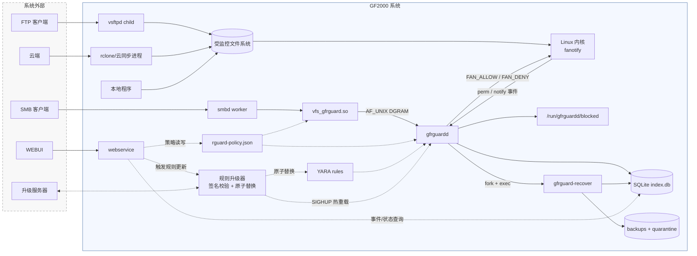
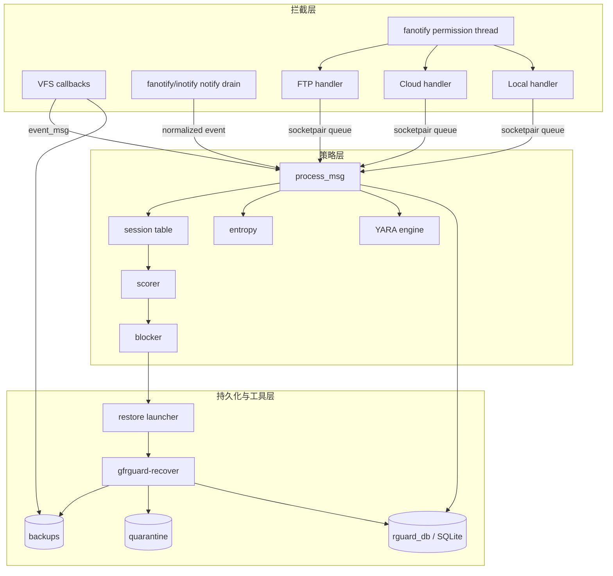
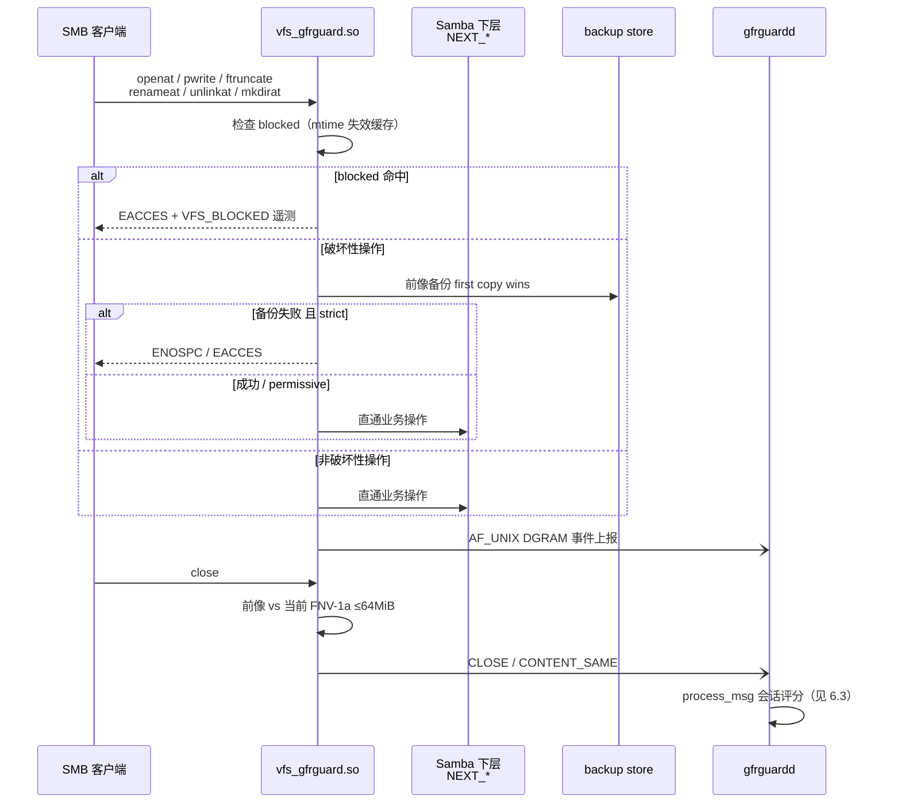
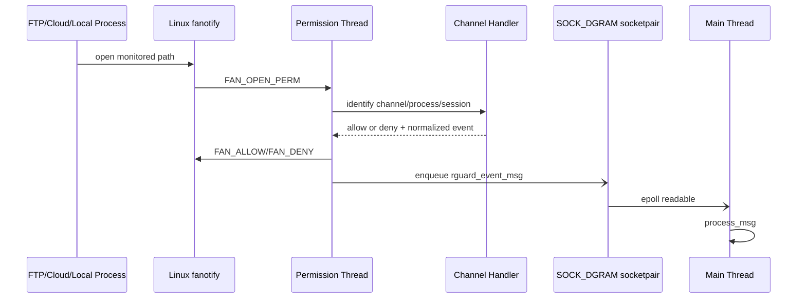
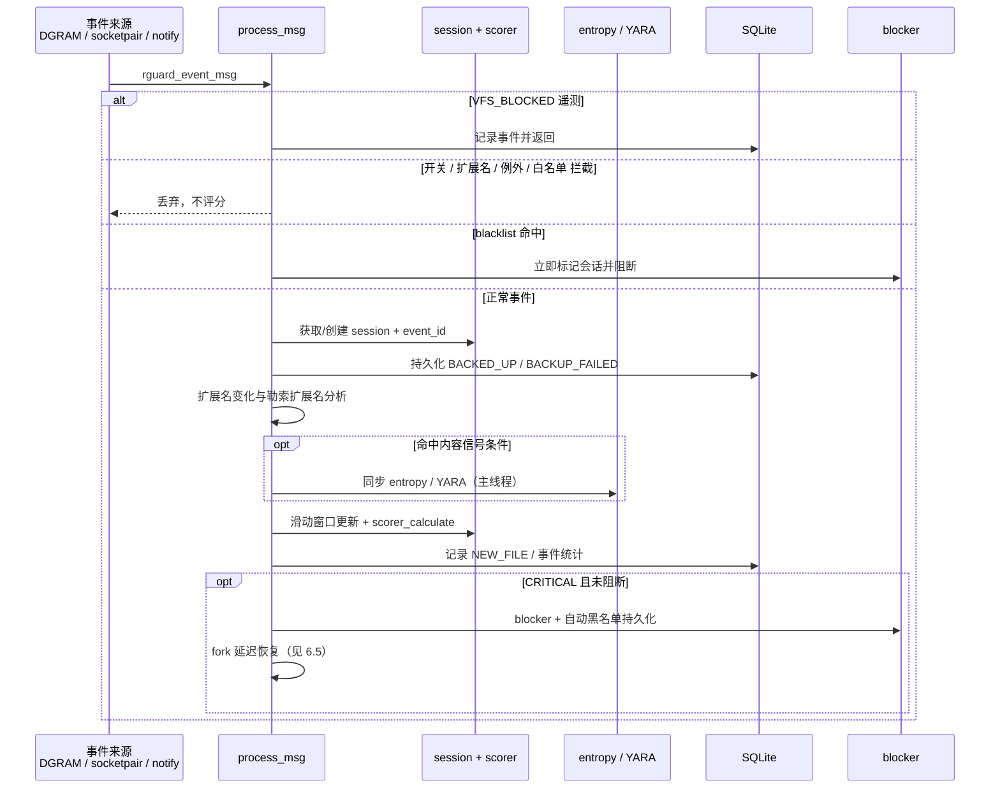
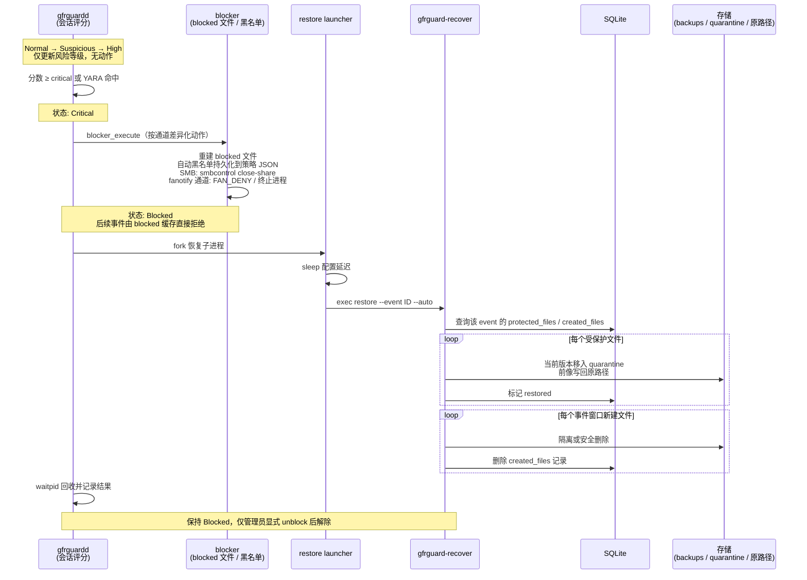
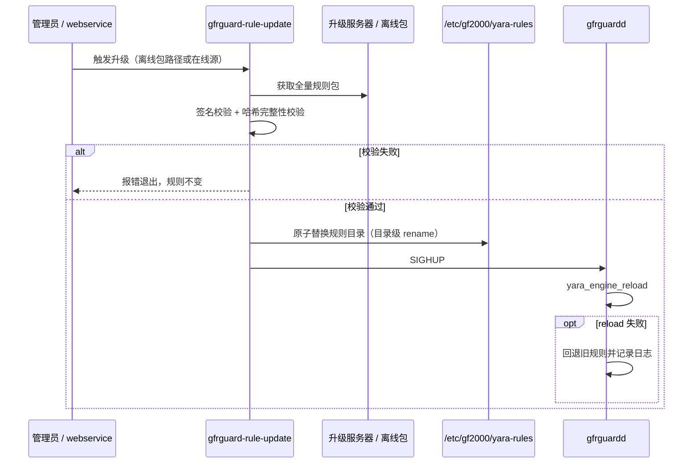
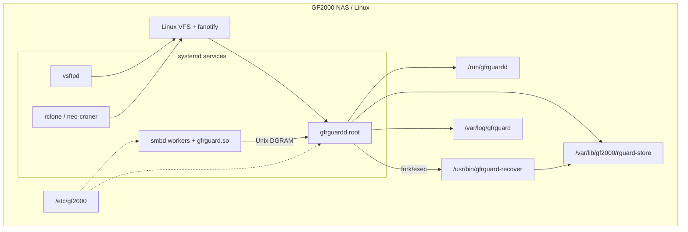

# GF2000 APPCHECK 软件架构文档

| 项目 | 内容 |
|---|---|
| 文档编号 | GF2000_APPCHECK_SA_01 |
| 版本号 | V1.0 |
| 编制日期 | 2026-07-22 |

## 1. 简介

### 1.1 目的

本文描述 GF2000 APPCHECK（下称 GFRGuard）的软件架构，回答以下问题：

1. 四类文件访问事件如何被拦截、归一化并送入统一策略管线；
2. 修改前前像、会话评分、阻断和恢复如何协作；
3. 各通道的故障边界、权限边界和数据所有权是什么；
4. 系统的规模与性能约束、复用资产、质量属性。

### 1.2 范围

本文覆盖当前仓库中可构建或可部署的组件：

- `vfs_gfrguard.so`：Samba VFS 拦截模块
- `gfrguardd`：策略守护进程及 FTP、云同步、本地 fanotify 通道
- `gfrguard-recover`：事件级恢复和解除阻断工具
- `gfrguard-rule-update`规则包下载、签名校验和原子升级器
- 公共配置、协议、SQLite、日志、备份复制实现
- 默认策略、勒索扩展名和 YARA 规则
- 邮件告警队列和 SMTP 发送器

### 1.3 术语

| 术语 | 本文定义 |
|---|---|
| 前像（preimage） | 既有文件发生破坏性操作前保存的最早版本 |
| 破坏性操作 | 可能覆盖、截断或删除既有内容的操作；不等同于“恶意”或“文件损坏” |
| 会话 | 评分状态的聚合键，最终由 `username@client_ip` 形式生成；各通道用伪用户/IP编码身份 |
| CONTENT_SAME | 前像与当前文件等长且 FNV-1a 结果相同；仅用于撤销一次 modified 计数 |
| 内容信号 | HIGH_ENTROPY 或 YARA_MATCH；会话级布尔证据：高熵首次命中置位、权重只加一次，YARA 任一命中直接提升 CRITICAL；不形成逐文件损坏状态，不按命中文件数累计 |
| 行为维度 | 参与加权求和的行为计数指标：modified / rename / delete / touched_dirs / ext_change；任何单一维度不得单独达到 CRITICAL |
| 定性证据 | YARA 命中或勒索扩展名命中；与行为维度共同支撑 CRITICAL 判定，并解除单维度封顶 |
| FID 模式 | `FAN_REPORT_DFID_NAME` fanotify 通知，使用目录 file handle 和文件名重建路径 |

### 1.4 参考资料

| 文档 | 用途 |
|---|---|
| `requirements.md` | 需求说明 |
| `design.md` | 设计说明 |
| Linux `fanotify(7)` | 非 SMB 通道内核接口 |
| Samba VFS API | SMB 回调 ABI |

## 2. 技术规格与技术选型

### 2.1 技术规格

| 项目 | 规格 |
|---|---|
| 核心语言 | C17 |
| 管理面 | webservice：Python 3 + Flask |
| 目标平台 | GF2000 NAS，Linux，x86-64（Yocto poky `corei7-64` 目标） |
| 进程形态 | smbd 内嵌 VFS 模块 + root 守护进程 + 恢复工具 + 升级工具 + Flask webservice |
| 内核接口 | fanotify API |
| 外部库 | SQLite3、libyara、pthread、libm |
| Samba 依赖 | 按 Samba 源码树（waf 产物 `bin/default`）编译|
| 管理面部署 | webservice 监听 `127.0.0.1:8880` |
| 进程管理 | systemd 托管 smbd / gfrguardd / webservice |

### 2.2 技术选型

| 选型 | 理由 |
|---|---|
| C17 单一代码库 | VFS 模块运行在 smbd 进程地址空间内，daemon 以 root 常驻；C 无运行时依赖，启动快、内存可预期 |
| Samba VFS 模块 | SMB 拦截的唯一客户端透明方案；不改 Samba 源码，不维护内核补丁 |
| fanotify 而非内核模块/eBPF | 内核原生接口，无需 out-of-tree 模块，权限事件可同步应答 ALLOW/DENY |
| SQLite 嵌入式库 | 单节点部署，状态只在本机一致 |
| YARA | 内容特征检测的事实标准 |

## 3. 架构目标和约束

### 3.1 目标

| 目标 | 当前实现手段 |
|---|---|
| 客户端透明 | SMB 通过 VFS 回调；FTP/云/本地通过 fanotify/inotify |
| 修改前可恢复 | SMB 破坏性操作前保存前像；fanotify 通道在权限事件中执行通道前置处理 |
| 多信号检测 | 操作频率、扩展名、目录扩散、熵、YARA 汇总到会话评分 |
| 快速阻断 | SMB 使用 blocked 文件和 `smbcontrol`；其他通道使用 FAN_DENY/进程或任务动作 |
| 事件级恢复 | `event_id` 关联前像、新建文件和恢复状态 |
| 本地部署 | 配置、规则、日志、数据库和前像均保存在设备本地 |

### 3.2 硬约束

| 约束 | 架构影响 |
|---|---|
| Samba VFS ABI 随版本变化 | VFS 模块按目标 Samba 版本分别构建，回调签名条件编译 |
| fanotify 依赖内核编译选项 | 需启用 `CONFIG_FANOTIFY` 和 `CONFIG_FANOTIFY_ACCESS_PERMISSIONS`（FAN_OPEN_PERM 应答能力）；Yocto 内核 defconfig 缺项时 `fanotify_init` 失败，FTP/云/本地三通道整体不可用 |
| FID 模式依赖内核版本和文件系统能力 | `FAN_REPORT_DFID_NAME` 要求内核 ≥ 5.9 且被监控文件系统支持 exportfs 文件句柄（ext4/xfs/btrfs 支持，tmpfs 等不支持）；不满足时 notify 通道路径重建失效 |
| fanotify 需要 root/CAP_SYS_ADMIN | daemon 以高权限运行；容器/WSL 环境通常不能完成真实集成测试 |
| permission 与 FID notification 能力不同 | 使用两个 fanotify fd；权限线程和通知处理分离 |
| fanotify permission 必须及时应答 | 权限路径不能执行无界内容扫描；故障应优先放行业务 |
| fanotify permission 只支持 open / access 文件前触发 | unlink / rename 等场景下无法完成前像备份操作 |
| Unix DGRAM 无确认 | VFS 上报是尽力而为，daemon 不可用时不能依赖消息完整性 |
| 单节点 SQLite | 状态仅在本机一致，不支持多节点并发写或共享阻断状态 |
| 不做损坏判定与计数阻断| 数据模型不保存逐文件 damaged/corrupted/encrypted 状态；内容信号（熵/YARA）仅作会话级证据参与行为评分，阻断依据是会话行为评分越限，**不是损坏文件数量** |
| 单一行为维度不得单独触发阻断 | 任何单一计数维度（修改/重命名/删除/目录扩散）的加权贡献不得单独达到 CRITICAL；CRITICAL 必须由至少两个独立维度、或维度评分叠加定性证据（YARA/勒索扩展名）共同达到 |
| 保护范围限定用户共享数据 | 只监控对外导出的 SMB 共享及 FTP/云/本地监控目录；不保护操作系统及系统关键文件，监控路径配置必须排除系统目录 |

## 4. 用例视图

| 用例 | 当前代码路径 | 状态 |
|---|---|---|
| UC-1 SMB 覆盖写保护 | `gf_openat` 判断既有破坏性写 → `do_backup` → NEXT open → DGRAM 上报 | 已实现 |
| UC-2 同内容覆盖降噪 | `gf_close` 前像/当前文件哈希 → CONTENT_SAME → session 撤销 modified → scorer 限分 | 已实现 |
| UC-3 批量勒索行为阻断 | WRITE/RENAME/DELETE/目录扩散/扩展名/内容信号 → 会话评分 → CRITICAL | 已实现 |
| UC-4 FTP 文件事件检测 | fanotify 通道识别 vsftpd、归一化事件、权限拒绝及进程阻断 | 已实现 |
| UC-5 云同步扩散控制 | 识别云任务、使用独立长窗口、删除/禁用任务并记录配置 | 部分实现，依赖平台命令和配置 |
| UC-6 本地进程阻断 | `/proc` 身份解析、PID starttime 防复用、会话阻断后终止进程 | 已实现 |
| UC-7 自动恢复 | CRITICAL → fork → 延迟 exec `gfrguard-recover restore --event` | 已实现 |
| UC-8 配置/规则热重载 | SIGHUP 重读 JSON、同步 blocked、重建 marks、reload YARA | 已实现 |
| UC-9 邮件告警 | 事件进入邮件队列并定时汇总发送 | 规划 |
| UC-10 签名规则升级 | 校验离线/在线规则包并原子替换 | 规划 |

## 5. 逻辑视图

## 6. 实现视图

### 6.1 概述

实现模型分为三层，依赖方向自上而下，禁止反向依赖：

| 层 | 内容 | 加入规则与边界 |
|---|---|---|
| L1 拦截层 | VFS 回调、fanotify 双 fd 基础设施、FTP/Cloud/Local 通道 handler | 只做拦截、前像、身份解析和上报，**不做策略判断**；经定长协议进入策略层，不直接读写 SQLite |
| L2 策略层 | process_msg 管线、session、scorer、entropy、YARA、blocker | 只依赖SQLite/YARA 库；不直接调用 Samba API，不感知内核接口细节 |
| L3 持久化与工具层 | sqlite db，文件恢复工具、规则升级工具 | 只依赖公共持久化格式和运行文件布局，不链接 daemon 内部模块 |

### 6.2 拦截层

#### 6.2.1 SMB VFS 模块

已注册回调：

| 回调 | 当前职责 |
|---|---|
| connect | 调用下一层、读取 share 参数、验证 store、初始化 DGRAM、检查 blocked |
| disconnect | 关闭 DGRAM 并调用下一层 |
| openat | 识别写模式、检查 blocked、对既有破坏性写创建前像、挂接 FSP 状态、上报事件 |
| pwrite | 处理 procfd 延迟前像、检查运行中阻断、避免重复上报 |
| ftruncate | 捕获 O_APPEND 后再 truncate 的绕过、补做前像 |
| renameat | 操作后上报源路径和目标名；扩展名分析由 daemon 完成 |
| unlinkat | 删除前创建前像，严格模式失败则拒绝删除 |
| mkdirat | 检查 blocked 并上报新建目录事件 |
| close | 对最多 64 MiB 的前像/当前文件做全量 FNV-1a 比对，上报 CLOSE |

时序图：

#### 6.2.2 fanotify通道

双事件入口：

| 入口 | 线程/循环 | 作用 |
|---|---|---|
| permission fd | 独立 pthread | 处理 `FAN_OPEN_PERM`，必须向内核回复 ALLOW/DENY |
| notification fd | daemon 主循环 drain | 处理 CLOSE_WRITE、MODIFY、CREATE、DELETE、MOVE 等异步事件 |
| socketpair | permission 线程 → 主线程 | 把归一化消息交给统一 `process_msg`，避免在线程中修改会话/SQLite |

时序图：

通知归一化：

| 内核事件 | 归一化事件 | 关键标志/处理 |
|---|---|---|
| CREATE | OPEN | NEW_FILE |
| MODIFY | WRITE | 经 fangate 抑制同路径洪泛 |
| CLOSE_WRITE | CLOSE | 触发 daemon 内容信号分析 |
| DELETE | DELETE | 事后检测；内核无删除 permission 事件 |
| FAN_RENAME | RENAME | 解析 OLD_DFID_NAME 与 NEW_DFID_NAME；保留源路径、目标完整路径和目标名用于扩展名分析 |

### 6.3 策略层

#### 6.3.1 

#### 6.3.2 会话状态

`session_table` 使用 1024 槽 FNV-1a 哈希和线性探测。会话保存：

- modified、rename、delete；
- touched_dirs（最多记录固定数量目录 hash）；
- ext_change、ransom_ext；
- high_entropy、yara_match；
- content_same；
- event_id、risk_score、risk_level、is_blocked 和时间窗口。

短窗口重置操作计数，长窗口重置目录集合、事件 ID 和风险等级，但阻断状态不自动清除。Cloud 使用更长的独立窗口。

#### 6.3.3 评分模型

基础分数为：

$$
S = \min\left(100,
m w_m+r w_r+d w_d+t w_t+e w_e+x w_x+\sigma_h w_h
\right)
$$

其中：

- $m,r,d,t$ 分别为修改、重命名、删除和目录扩散计数——**行为计数**；
- $e,x$ 分别为扩展名变化和勒索扩展名计数；
- $\sigma_h \in \{0,1\}$ 为高熵会话级信号：首次命中置位、加固定权重 $w_h$，**不按命中文件数累计**；
- 权重和 NORMAL/SUSPICIOUS/HIGH/CRITICAL 阈值来自策略配置。

修正规则：

- CONTENT_SAME 占写活动 80% 以上时分数清零；50% 以上时封顶到 warn 以下；
- 纯删除会话封顶 60；若 critical 配置不大于 60，该规则仍可能到 CRITICAL，配置校验必须保证阈值关系；
- 单一维度会话封顶到 critical 以下：仅含一种非零行为计数的会话（无论修改、重命名还是目录扩散），其加权分不得单独达到 CRITICAL；出现第二个维度或定性证据（YARA/勒索扩展名）时解除。典型批量加密天然伴随目录扩散（$t>0$），不受此限；
- 任一 YARA 命中把分数至少提升到 critical；
- 普通 OPEN/WRITE/TRUNCATE 延迟评分，等待 CLOSE 或更强信号，降低批量同内容写误报。

#### 6.3.4 内容信号的实际触发

| 信号 | SMB | FTP/Cloud/Host | 执行位置 |
|---|---|---|---|
| CONTENT_SAME | tracked file CLOSE，最大 64 MiB 全量比较 | 无前像比较 | smbd worker，同步 |
| HIGH_ENTROPY | OPEN/WRITE/TRUNCATE | CREATE/MODIFY | daemon 主线程，同步采样前 8 KiB |
| YARA_MATCH | CLOSE | CLOSE_WRITE | daemon 主线程，同步扫描 |

熵与 YARA 都是会话级布尔信号：会话首次命中后，该会话后续文件**不再执行对应扫描**

### 6.4 持久化与工具层

#### 6.4.1 阻断与恢复

阻断动作由策略层 blocker 执行，恢复由工具层 `gfrguard-recover` 完成

会话风险状态共五级：Normal / Suspicious / High / Critical / Blocked，阈值来自策略配置。越过 warn/high 阈值只改变风险等级，不产生动作；到达 Critical（或任一 YARA 命中直接提升）才进入阻断流程。完整时序：

阻断动作的粒度边界：SMB 的 `smbcontrol smbd close-share` 是 share 粒度，可能断开同一共享上的无关会话；后续精确拒绝依赖 blocked 文件中的 IP。

恢复对象由 `event_id` 下的 `protected_files` 和 `created_files` 决定，不依赖逐文件损坏判定。隔离对象是风险事件关联文件的恢复前当前版本，以及事件窗口中新建的常规文件；隔离不表示系统已经对该文件形成 damaged/corrupted/encrypted 判定。

#### 6.4.2 规则升级

定位：独立 CLI（`gfrguard-rule-update`），按需执行，不常驻。状态：**规划**——当前仓库仅有 daemon 侧 SIGHUP / `yara_engine_reload` 热重载能力，升级器本体无代码。

规划时序：

设计决策：复用既有 SIGHUP 热重载通道，不新增 IPC；目录级 rename 保证 daemon 任意时刻要么看到完整旧规则、要么看到完整新规则；reload 失败回退旧规则，升级事故不影响检测主路径，符合故障放行原则。

#### 6.4.3 SQLite 持久化

表结构见 8.1，本节只说明所有权与一致性边界：

- **写入者唯一**：`events` / `protected_files` / `created_files` / `cloud_task_configs` 的业务写入全部在 daemon 主线程；recover 只更新恢复状态字段；webservice 只读查询。三方各自打开 `index.db`，不共享连接。
- **跨层非原子**：前像文件创建（L1 VFS）与 `protected_files` 入库（L2 daemon）不是一个事务——进程在两者之间崩溃会产生无索引的磁盘前像；空间管理定时任务负责收敛（见 9.2）。
- **schema 兼容**：用 `ALTER TABLE` 补充历史列做就地迁移，新旧版本 daemon / recover 可混跑。
- **单机语义**：SQLite 保证本机事务一致，不支持多节点共享阻断状态（见 3.2 硬约束）。

## 7. 进程视图

| 执行单元 | 数量 | 主要职责 | 阻塞风险 |
|---|---:|---|---|
| smbd worker + VFS | 每连接一个或由 Samba 管理 | 拦截、前像、blocked 检查、CLOSE 哈希、DGRAM 上报 | 前像复制和最大 64 MiB 双文件读取 |
| gfrguardd 主线程 | 1 | epoll、process_msg、SQLite、熵、YARA、notify drain、timer、reap | YARA/SQLite/队列 drain 均可能阻塞 |
| fanotify permission thread | 1 | permission 事件、通道识别、ALLOW/DENY、入队 | 必须及时响应；不能做递归文件打开扫描 |
| recover 子进程 | 按阻断事件 | 延迟执行恢复工具 | 可并发竞争同一路径/前像 |
| 外部业务进程 | 不定 | vsftpd/rclone/本地 I/O | permission 事件期间被内核挂起 |

主循环同时监听 VFS socket、60 秒 timerfd 和 permission socketpair。对 permission 队列使用 `while (fanotify_process_queued() > 0)` 完全排空，持续洪泛时可能饿死其他 fd；之后才 drain notify 并回收恢复子进程。

## 8. 数据与部署视图

### 8.1 SQLite

当前 schema 包含：

| 表 | 所有者 | 用途 |
|---|---|---|
| events | daemon | 会话事件、峰值风险、动作和状态 |
| protected_files | daemon/recover | 原路径、前像路径、元数据、操作类型和恢复状态 |
| created_files | daemon/recover | 事件窗口中新建路径，恢复时清理 |
| cloud_task_configs | cloud/recover | 被阻断云任务的配置和恢复状态 |

代码包含兼容性迁移，用 `ALTER TABLE` 补充历史列。数据库使用 SQLite 单机事务语义；前像文件创建和 DB 插入不是一个原子事务。

### 8.2 协议

`rguard_event_msg` 是本机 ABI 风格固定结构：

- 携带 message/op/flags、时间、inode/size/mtime/uid/gid/mode；
- 携带 username、client_ip、share_name、绝对 file_path 和 new_name；
- 携带 source_type 和 proto_version；
- 新 daemon 接受版本 0 和当前版本，丢弃高于自身版本的消息；
- socket 权限允许外部写入，接收端会强制字符串末尾 NUL，但没有发送方认证。

该 socket 是安全边界：本机低权限进程可能伪造事件并影响评分、数据库和阻断。部署应收紧 Unix socket 权限或增加凭据校验（如 `SO_PASSCRED`）。

### 8.3 文件布局

| 路径 | 内容 |
|---|---|
| `/etc/gf2000/rguard-policy.json` | daemon 策略 |
| `/etc/gf2000/yara-rules/` | YARA 规则目录 |
| `/var/lib/gf2000/rguard-store/index.db` | SQLite 状态 |
| `<store>/backups/<share>/<relative>` | 最早前像 |
| `<store>/quarantine/<event>/...` | 恢复前隔离的当前版本 |
| `/run/gfrguardd/gfrguardd.sock` | VFS 事件 DGRAM |
| `/run/gfrguardd/blocked` | SMB/FTP IP 阻断列表 |
| `/var/log/gfrguard/gfrguard.log` | 结构化事件日志 |

### 8.4 部署图

## 9. 大小和性能

### 9.1 规模

| 模块 | 代码规模 | 交付形态 | 二进制大小（-O2 -g，含调试信息） |
|---|---:|---|---:|
| `src/vfs` | ~1.2k 行 C | `gfrguard.so`（按 Samba 4.19.6 / 4.23.5 各一份） | ~70 KB |
| `src/daemon` | ~5.0k 行 C | `gfrguardd` | ~350 KB |
| `src/common` | ~5.6k 行 C（含内嵌 cJSON） | 静态库，链接进 daemon/recover | — |
| `src/recover` | ~0.5k 行 C | `gfrguard-recover` | ~88 KB |
| `web/` | ~0.8k 行 Python | webservice | — |

C 代码合计约 12.2k 行。规模结论：这是一个小系统，复杂度集中在 daemon 的事件归一化和会话评分，不在代码量。

### 9.2 影响架构的尺寸特征

| 尺寸 | 值 | 架构影响 |
|---|---|---|
| 事件消息 | 定长 4608 B（文件路径上限 4096 B） | 无变长解析；超长路径事件无法表达，只能丢弃 |
| 会话表 | 1024 桶哈希 + 线性探测 | 会话数有硬上限；洪泛下新会话可能无法建立 |
| 目录扩散集合 | 每会话最多 256 个目录 hash | 超上限的扩散行为不再计入评分 |
| CLOSE 内容比较 | ≤ 64 MiB 全量 FNV-1a | 大文件不做 CONTENT_SAME 降噪，按修改计分 |
| 熵采样 | 文件头 8 KiB | 只覆盖文件开头；尾部加密的文件可能漏检 |
| 空间管理 | 60 s 定时，超 `max_usage_percent` 清理 `cleanup_days` 天前已恢复备份 | 前像存储有自我收敛上限 |

### 9.3 性能约束

| 路径 | 约束 | 手段 |
|---|---|---|
| SMB I/O 同步路径 | 非破坏性操作直通 `NEXT_*`，只允许一次 blocked 文件检查 | mtime 失效缓存，避免每次 stat |
| SMB 前像复制 | 与客户端写操作同步完成 | reflink → copy_file_range → read/write 三级降级 |
| 事件上报 | 不得阻塞 smbd | AF_UNIX DGRAM fire-and-forget，EAGAIN 有限重试后丢弃 |
| fanotify permission 应答 | 应答时延直接等于业务进程 open 阻塞时间 | 独立线程、禁止无界内容扫描、故障优先放行 |
| daemon 主循环 | YARA/CLOSE 哈希/SQLite 均在主线程 | 已知吞吐瓶颈；慢操作会推迟所有通道处理（见 6.3） |

## 10. 复用资产

### 10.1 公司 RAB 中心与部门资产

当前仓库未声明复用公司 RAB 中心或部门资产，**待确认**。webservice/WEBUI 若来自平台既有框架，应在此补充来源。

### 10.2 项目内复用

| 资产 | 复用方式 |
|---|---|
| `rguard_common`（protocol/config/db/log/errors/cJSON） | 静态库，daemon、recover共同链接 |
| `gfrguardd_blocker.c` | recover 工具直接编译复用，解除阻断逻辑不复制 |
| `rguard_event_msg` 定长协议 | VFS 与 daemon 共享同一头文件，结构偏移静态断言锁定 |

### 10.3 外部资产

| 资产 | 来源/许可 | 复用方式 |
|---|---|---|
| cJSON | Dave Gamble，MIT | 源码内嵌 `src/common/`，消除外部依赖版本漂移 |
| SQLite | 公有领域 | 动态链接，状态存储 |
| libyara | VirusTotal，BSD-3 | 可选动态链接，缺失时降级编译 |
| Samba VFS API | GPLv3 | 编译期头文件依赖，模块加载进 smbd；**GPL 兼容分发方式需在发布前确认** |
| Flask | BSD / BSD-2 | webservice 框架 |
| fanotify / inotify / systemd | Linux 平台 | 内核与系统能力，非代码资产 |

## 11. 质量

| 质量属性 | 架构手段 |
|---|---|
| 可扩展性 | 新通道 = 新 handler + `source_type`，协议与评分管线不变；新检测维度 = scorer 权重项 |
| 可靠性 | 组件故障优先放行业务；DGRAM fire-and-forget；strict/permissive 双模式区分数据安全与业务连续 |
| 可恢复性 | 前像 first-copy-wins + `event_id` 关联保护文件与新建文件
| 可移植性 | 双 Samba ABI 分别构建；Yocto 交叉编译；YARA 可选降级
| 安全性 | 前像/恢复路径 O_NOFOLLOW + 路径校验防符号链接攻击；PID starttime 防复用；blocked 文件原子重建 |
| 性能 | 直通路径只加一次缓存检查，慢路径全部移出 I/O 主路 |
