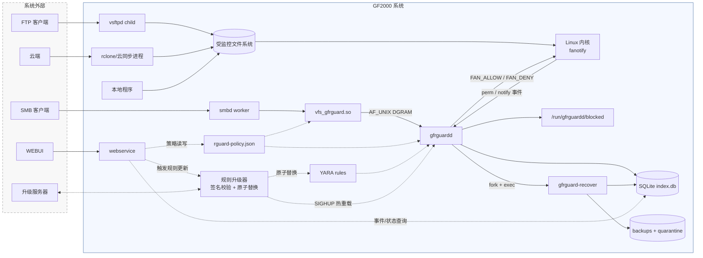
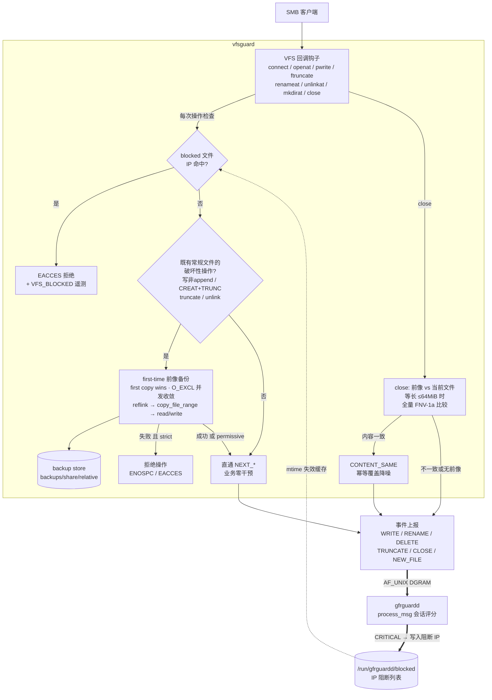
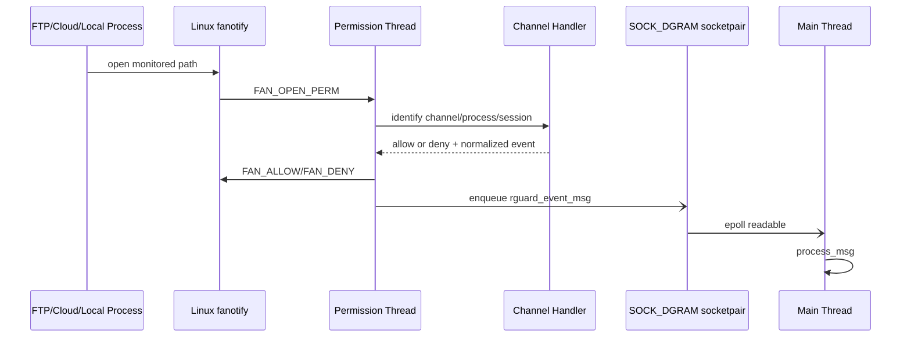
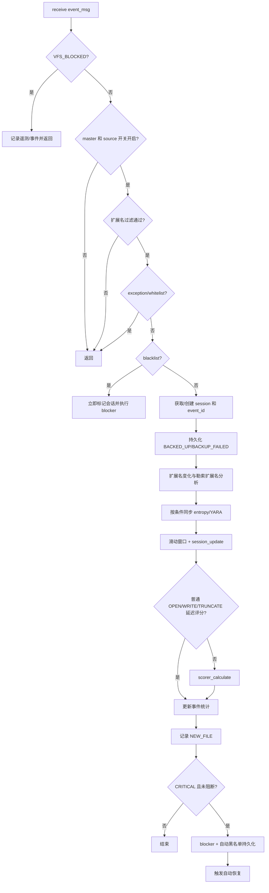
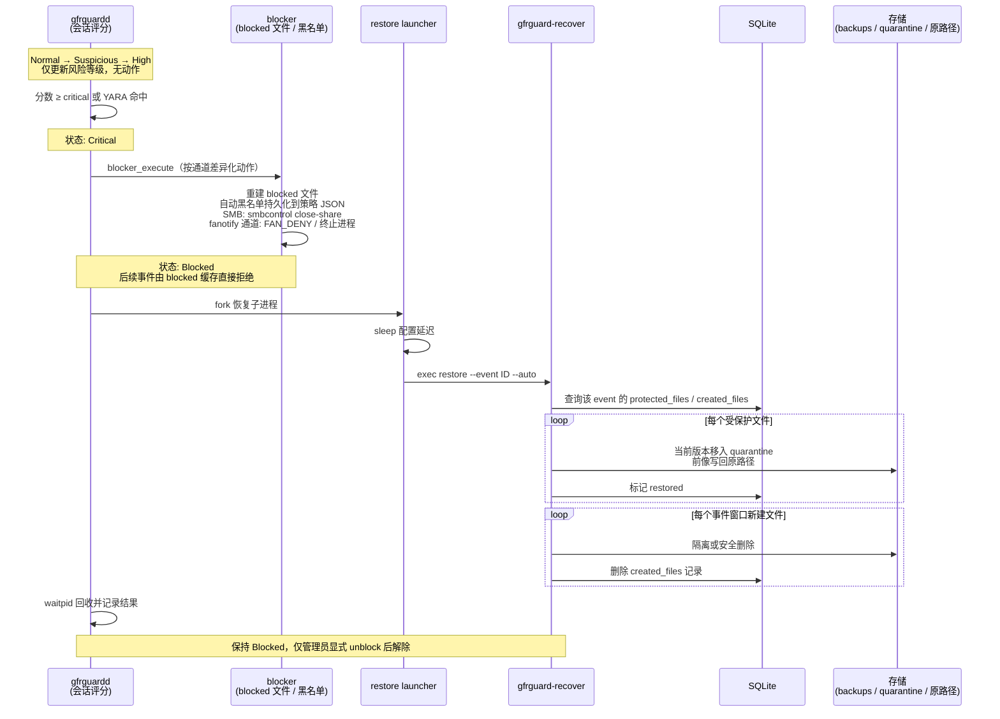
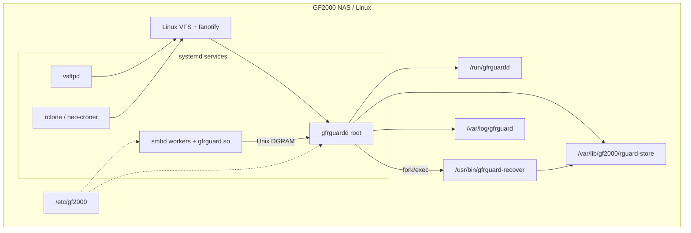

# GF2000 APPCHECK 软件架构文档

| 项目 | 内容 |
|---|---|
| 文档编号 | GF2000_APPCHECK_SA_01 |
| 版本号 | V1.0 |
| 编制日期 | 2026-07-22 |

---

## 1. 简介

### 1.1 目的

本文从用例、逻辑、运行、部署、实现、数据和安全视图描述 GF2000 APPCHECK（下称 GFRGuard）的当前软件架构，回答以下问题：

1. 四类文件访问事件如何被拦截、归一化并送入统一策略管线；
2. 修改前前像、会话评分、阻断和恢复如何协作；
3. 各通道的故障边界、权限边界和数据所有权是什么；
4. 哪些结论有代码或测试证据，哪些仍属于规划。

### 1.2 范围

本文覆盖当前仓库中可构建或可部署的组件：

- `vfs_gfrguard.so`：Samba VFS 拦截模块；
- `gfrguardd`：策略守护进程及 FTP、云同步、本地 fanotify 通道；
- `gfrguard-recover`：事件级恢复和解除阻断工具；
- `gfrguard-rule-update`规则包下载、签名校验和原子升级器；
- 公共配置、协议、SQLite、日志、备份复制实现；
- 默认策略、勒索扩展名和 YARA 规则；
- 邮件告警队列和 SMTP 发送器；
- 单元测试和集成测试；

### 1.3 术语

| 术语 | 本文定义 |
|---|---|
| 前像（preimage） | 既有文件发生破坏性操作前保存的最早版本；代码中仍普遍使用 backup/risky 命名 |
| 破坏性操作 | 可能覆盖、截断或删除既有内容的操作；不等同于“恶意”或“文件损坏” |
| 会话 | 评分状态的聚合键，最终由 `username@client_ip` 形式生成；各通道用伪用户/IP编码身份 |
| CONTENT_SAME | 前像与当前文件等长且 FNV-1a 结果相同；仅用于撤销一次 modified 计数 |
| 内容信号 | HIGH_ENTROPY 或 YARA_MATCH；当前实现会参与评分，但不形成逐文件损坏状态 |
| 损坏判定 | 对文件设置 damaged/corrupted/encrypted 等状态的业务判断；当前数据模型未实现 |
| FID 模式 | `FAN_REPORT_DFID_NAME` fanotify 通知，使用目录 file handle 和文件名重建路径 |

### 1.4 参考资料

| 文档 | 用途 |
|---|---|
| `requirements.md` | 需求来源 |
| `design.md` | 原详细设计 |
| `utest.md` | 测试设计 |
| Linux `fanotify(7)` | 非 SMB 通道内核接口 |
| Samba VFS API | SMB 回调 ABI |

---

## 2. 技术规格与技术选型

### 2.1 技术规格

| 项目 | 规格 |
|---|---|
| 核心语言 | C17 |
| 管理面 | webservice：Python 3 + Flask |
| 目标平台 | GF2000 NAS，Linux，x86-64（Yocto poky `corei7-64` 目标） |
| 进程形态 | smbd 内嵌 VFS 模块 + root 守护进程 + 恢复工具 + 升级工具 + Flask webservice |
| 内核接口 | fanotify API |
| 外部库 | SQLite3、libyara、pthread、libm |
| Samba 依赖 | 按 Samba 源码树（waf 产物 `bin/default`）编译|
| 管理面部署 | webservice 监听 `127.0.0.1:8880` |
| 进程管理 | systemd 托管 smbd / gfrguardd / webservice |

### 2.2 技术选型

| 选型 | 理由 |
|---|---|
| C17 单一代码库 | VFS 模块运行在 smbd 进程地址空间内，daemon 以 root 常驻；C 无运行时依赖，启动快、内存可预期 |
| Samba VFS 模块 | SMB 拦截的唯一客户端透明方案；不改 Samba 源码，不维护内核补丁 |
| fanotify 而非内核模块/eBPF | 内核原生接口，无需 out-of-tree 模块，权限事件可同步应答 ALLOW/DENY |
| SQLite 嵌入式库 | 单节点部署，状态只在本机一致 |
| YARA | 内容特征检测的事实标准 |

---

## 3. 架构目标和约束

### 3.1 目标

| 目标 | 当前实现手段 |
|---|---|
| 客户端透明 | SMB 通过 VFS 回调；FTP/云/本地通过 fanotify/inotify |
| 修改前可恢复 | SMB 破坏性操作前保存前像；fanotify 通道在权限事件中执行通道前置处理 |
| 多信号检测 | 操作频率、扩展名、目录扩散、熵、YARA 汇总到会话评分 |
| 快速阻断 | SMB 使用 blocked 文件和 `smbcontrol`；其他通道使用 FAN_DENY/进程或任务动作 |
| 事件级恢复 | `event_id` 关联前像、新建文件和恢复状态 |
| 本地部署 | 配置、规则、日志、数据库和前像均保存在设备本地 |

### 3.2 硬约束

| 约束 | 架构影响 |
|---|---|
| Samba VFS ABI 随版本变化 | VFS 模块按目标 Samba 版本分别构建，回调签名条件编译 |
| fanotify 依赖内核编译选项 | 需启用 `CONFIG_FANOTIFY` 和 `CONFIG_FANOTIFY_ACCESS_PERMISSIONS`（FAN_OPEN_PERM 应答能力）；Yocto 内核 defconfig 缺项时 `fanotify_init` 失败，FTP/云/本地三通道整体不可用 |
| FID 模式依赖内核版本和文件系统能力 | `FAN_REPORT_DFID_NAME` 要求内核 ≥ 5.9 且被监控文件系统支持 exportfs 文件句柄（ext4/xfs/btrfs 支持，tmpfs 等不支持）；不满足时 notify 通道路径重建失效 |
| fanotify 需要 root/CAP_SYS_ADMIN | daemon 以高权限运行；容器/WSL 环境通常不能完成真实集成测试 |
| permission 与 FID notification 能力不同 | 使用两个 fanotify fd；权限线程和通知处理分离 |
| fanotify permission 必须及时应答 | 权限路径不能执行无界内容扫描；故障应优先放行业务 |
| Unix DGRAM 无确认 | VFS 上报是尽力而为，daemon 不可用时不能依赖消息完整性 |
| 单节点 SQLite | 状态仅在本机一致，不支持多节点并发写或共享阻断状态 |

### 3.3 零破坏原则的真实边界

“组件故障不影响业务”并非无条件成立：

- daemon/fanotify 初始化失败时，主程序可继续运行，非 SMB 通道失去检测；
- VFS DGRAM 上报失败不会阻止 Samba I/O；
- VFS `permissive` 模式下前像失败仍放行；
- VFS 默认 `strict` 模式下前像失败会以 `ENOSPC`/`EACCES` 拒绝破坏性操作；
- blocked 命中会主动返回 `EACCES`；
- 同步 CLOSE 哈希、YARA 扫描可能增加关闭延迟或阻塞 daemon 主循环。

因此，严格模式优先数据可恢复性，宽松模式优先业务连续性，两者不能同时宣称绝对“零影响”。

---

## 4. 用例视图

| 用例 | 当前代码路径 | 状态 |
|---|---|---|
| UC-1 SMB 覆盖写保护 | `gf_openat` 判断既有破坏性写 → `do_backup` → NEXT open → DGRAM 上报 | 已实现 |
| UC-2 同内容覆盖降噪 | `gf_close` 前像/当前文件哈希 → CONTENT_SAME → session 撤销 modified → scorer 限分 | 已实现 |
| UC-3 批量勒索行为阻断 | WRITE/RENAME/DELETE/目录扩散/扩展名/内容信号 → 会话评分 → CRITICAL | 已实现 |
| UC-4 FTP 文件事件检测 | fanotify 通道识别 vsftpd、归一化事件、权限拒绝及进程阻断 | 已实现 |
| UC-5 云同步扩散控制 | 识别云任务、使用独立长窗口、删除/禁用任务并记录配置 | 部分实现，依赖平台命令和配置 |
| UC-6 本地进程阻断 | `/proc` 身份解析、PID starttime 防复用、会话阻断后终止进程 | 已实现 |
| UC-7 自动恢复 | CRITICAL → fork → 延迟 exec `gfrguard-recover restore --event` | 已实现 |
| UC-8 配置/规则热重载 | SIGHUP 重读 JSON、同步 blocked、重建 marks、reload YARA | 已实现 |
| UC-9 邮件告警 | 事件进入邮件队列并定时汇总发送 | 规划，当前无代码 |
| UC-10 签名规则升级 | 校验离线/在线规则包并原子替换 | 规划，当前只有 YARA reload 能力 |

---

## 5. 逻辑视图

### 5.1 系统架构

### 5.2 组件分解

### 5.3 分层与依赖

| 层 | 模块 | 允许依赖 |
|---|---|---|
| L1 拦截层 | VFS、fanotify、通道 handler | 公共层、Samba/Linux API；通过协议进入策略层 |
| L2 策略层 | main/process_msg、session、scorer、entropy、YARA、blocker | 公共层、SQLite/YARA；不直接调用 Samba API |
| L3 公共层 | protocol、types、config、db、log、backup、hash | libc、SQLite、cJSON |
| L4 工具层 | recover | 公共持久化格式和运行文件 |

实际代码基本遵守单向依赖，但 `gfrguardd_main.c` 同时承担协议接收、策略编排、内容扫描、数据库写入和动作触发，属于高耦合控制器。

---

## 6. SMB VFS 架构

### 6.1 已注册回调

| 回调 | 当前职责 |
|---|---|
| connect | 调用下一层、读取 share 参数、验证 store、初始化 DGRAM、检查 blocked |
| disconnect | 关闭 DGRAM 并调用下一层 |
| openat | 识别写模式、检查 blocked、对既有破坏性写创建前像、挂接 FSP 状态、上报事件 |
| pwrite | 处理 procfd 延迟前像、检查运行中阻断、避免重复上报 |
| ftruncate | 捕获 O_APPEND 后再 truncate 的绕过、补做前像 |
| renameat | 操作后上报源路径和目标名；扩展名分析由 daemon 完成 |
| unlinkat | 删除前创建前像，严格模式失败则拒绝删除 |
| mkdirat | 检查 blocked 并上报新建目录事件 |
| close | 对最多 64 MiB 的前像/当前文件做全量 FNV-1a 比对，上报 CLOSE |

### 6.2 架构图

---

## 7. fanotify 与非 SMB 通道

### 7.1 双事件入口

| 入口 | 线程/循环 | 作用 |
|---|---|---|
| permission fd | 独立 pthread | 处理 `FAN_OPEN_PERM`，必须向内核回复 ALLOW/DENY |
| notification fd | daemon 主循环 drain | 处理 CLOSE_WRITE、MODIFY、CREATE、DELETE、MOVE 等异步事件 |
| socketpair | permission 线程 → 主线程 | 把归一化消息交给统一 `process_msg`，避免在线程中修改会话/SQLite |

### 7.2 通知归一化

| 内核事件 | 归一化事件 | 关键标志/处理 |
|---|---|---|
| CREATE | OPEN | NEW_FILE |
| MODIFY | WRITE | 经 fangate 抑制同路径洪泛 |
| CLOSE_WRITE | CLOSE | 触发 daemon 内容信号分析 |
| DELETE | DELETE | 事后检测；内核无删除 permission 事件 |
| FAN_RENAME | RENAME | 解析 OLD_DFID_NAME 与 NEW_DFID_NAME；保留源路径、目标完整路径和目标名用于扩展名分析 |

### 7.3 通道身份和动作

| 通道 | 识别来源 | 会话表达 | 阻断手段 |
|---|---|---|---|
| FTP | monitor path、`/proc/<pid>`、vsftpd 信息和 socket 线索 | FTP 用户/客户端 IP，失败时 unknown | FAN_DENY；校验 PID starttime 后 SIGTERM/SIGKILL |
| Cloud | task local path、rclone cmdline/任务配置 | `cloud@<task>` 等伪身份 | 删除/禁用 neo-croner 任务并终止相关进程；任务信息入库 |
| Host | monitor path、comm/exe/starttime | 本地进程名和 PID 身份 | FAN_DENY；PID 防复用后终止进程/进程组 |

身份解析依赖 `/proc` 的瞬时状态。进程退出、权限不足或命令行不符合预期时会降级为 unknown，降低会话隔离精度。

---

## 8. 策略引擎

### 8.1 `process_msg` 实际流程

管线顺序有两个重要后果：

1. 扩展名过滤、例外和白名单在前像元数据入库之前执行。VFS 可能已经创建磁盘前像，但 daemon 因策略提前返回而不写 `protected_files`，造成磁盘前像与恢复索引不一致。
2. 内容扫描和 SQLite 写入都在主线程执行。YARA 扫描耗时会推迟 DGRAM、fanotify 队列、timerfd 和恢复子进程回收。

### 8.2 会话状态

`session_table` 使用 1024 槽 FNV-1a 哈希和线性探测。会话保存：

- modified、rename、delete；
- touched_dirs（最多记录固定数量目录 hash）；
- ext_change、ransom_ext；
- high_entropy、yara_match；
- content_same；
- event_id、risk_score、risk_level、is_blocked 和时间窗口。

短窗口重置操作计数，长窗口重置目录集合、事件 ID 和风险等级，但阻断状态不自动清除。Cloud 使用更长的独立窗口。

### 8.3 评分模型

基础分数为：

$$
S = \min\left(100,
m w_m+r w_r+d w_d+t w_t+e w_e+x w_x+h w_h+y w_y
\right)
$$

其中：

- $m,r,d,t$ 分别为修改、重命名、删除和目录扩散计数；
- $e,x$ 分别为扩展名变化和勒索扩展名计数；
- $h,y$ 分别为高熵和 YARA 命中计数；
- 权重和 NORMAL/SUSPICIOUS/HIGH/CRITICAL 阈值来自策略配置。

修正规则：

- CONTENT_SAME 占写活动 80% 以上时分数清零；50% 以上时封顶到 warn 以下；
- 纯删除会话封顶 60；若 critical 配置不大于 60，该规则仍可能到 CRITICAL，配置校验必须保证阈值关系；
- 任一 YARA 命中把分数至少提升到 critical；
- 普通 OPEN/WRITE/TRUNCATE 延迟评分，等待 CLOSE 或更强信号，降低批量同内容写误报。

### 8.4 内容信号的实际触发

| 信号 | SMB | FTP/Cloud/Host | 执行位置 |
|---|---|---|---|
| CONTENT_SAME | tracked file CLOSE，最大 64 MiB 全量比较 | 无前像比较 | smbd worker，同步 |
| HIGH_ENTROPY | OPEN/WRITE/TRUNCATE | CREATE/MODIFY | daemon 主线程，同步采样前 8 KiB |
| YARA_MATCH | CLOSE | CLOSE_WRITE | daemon 主线程，同步扫描 |

---

## 9. 阻断与恢复

### 9.1 阻断与恢复时序

会话风险状态共五级：Normal / Suspicious / High / Critical / Blocked，阈值来自策略配置。越过 warn/high 阈值只改变风险等级，不产生动作；到达 Critical（或任一 YARA 命中直接提升）才进入阻断流程。完整时序：

阻断动作的粒度边界：SMB 的 `smbcontrol smbd close-share` 是 share 粒度，可能断开同一共享上的无关会话；后续精确拒绝依赖 blocked 文件中的 IP。

恢复对象由 `event_id` 下的 `protected_files` 和 `created_files` 决定，不依赖逐文件损坏判定。隔离对象是风险事件关联文件的恢复前当前版本，以及事件窗口中新建的常规文件；隔离不表示系统已经对该文件形成 damaged/corrupted/encrypted 判定。

### 9.2 恢复一致性边界

- 前像磁盘路径不包含 event_id，而 DB 唯一键是 `(event_id, original_path)`；跨窗口复用同一旧前像可能使多个事件指向同一文件。
- 成功恢复后删除前像；并发恢复同一路径可能竞争。
- 自动恢复以 fork/exec 解耦主循环，但当前没有同 event_id 去重锁。
- 原文件先隔离再恢复，跨文件系统时退化为 copy + unlink，不具备整事件原子性。

---

## 10. 进程与线程视图

| 执行单元 | 数量 | 主要职责 | 阻塞风险 |
|---|---:|---|---|
| smbd worker + VFS | 每连接一个或由 Samba 管理 | 拦截、前像、blocked 检查、CLOSE 哈希、DGRAM 上报 | 前像复制和最大 64 MiB 双文件读取 |
| gfrguardd 主线程 | 1 | epoll、process_msg、SQLite、熵、YARA、notify drain、timer、reap | YARA/SQLite/队列 drain 均可能阻塞 |
| fanotify permission thread | 1 | permission 事件、通道识别、ALLOW/DENY、入队 | 必须及时响应；不能做递归文件打开扫描 |
| recover 子进程 | 按阻断事件 | 延迟执行恢复工具 | 可并发竞争同一路径/前像 |
| 外部业务进程 | 不定 | vsftpd/rclone/本地 I/O | permission 事件期间被内核挂起 |

主循环同时监听 VFS socket、60 秒 timerfd 和 permission socketpair。对 permission 队列使用 `while (fanotify_process_queued() > 0)` 完全排空，持续洪泛时可能饿死其他 fd；之后才 drain notify 并回收恢复子进程。

---

## 11. 数据与部署视图

### 11.1 SQLite

当前 schema 包含：

| 表 | 所有者 | 用途 |
|---|---|---|
| events | daemon | 会话事件、峰值风险、动作和状态 |
| protected_files | daemon/recover | 原路径、前像路径、元数据、操作类型和恢复状态 |
| created_files | daemon/recover | 事件窗口中新建路径，恢复时清理 |
| cloud_task_configs | cloud/recover | 被阻断云任务的配置和恢复状态 |

代码包含兼容性迁移，用 `ALTER TABLE` 补充历史列。数据库使用 SQLite 单机事务语义；前像文件创建和 DB 插入不是一个原子事务。

### 11.2 协议

`rguard_event_msg` 是本机 ABI 风格固定结构：

- 携带 message/op/flags、时间、inode/size/mtime/uid/gid/mode；
- 携带 username、client_ip、share_name、绝对 file_path 和 new_name；
- 携带 source_type 和 proto_version；
- 新 daemon 接受版本 0 和当前版本，丢弃高于自身版本的消息；
- socket 权限允许外部写入，接收端会强制字符串末尾 NUL，但没有发送方认证。

该 socket 是安全边界：本机低权限进程可能伪造事件并影响评分、数据库和阻断。部署应收紧 Unix socket 权限或增加凭据校验（如 `SO_PASSCRED`）。

### 11.3 文件布局

| 路径 | 内容 |
|---|---|
| `/etc/gf2000/rguard-policy.json` | daemon 策略 |
| `/etc/gf2000/yara-rules/` | YARA 规则目录 |
| `/var/lib/gf2000/rguard-store/index.db` | SQLite 状态 |
| `<store>/backups/<share>/<relative>` | 最早前像 |
| `<store>/quarantine/<event>/...` | 恢复前隔离的当前版本 |
| `/run/gfrguardd/gfrguardd.sock` | VFS 事件 DGRAM |
| `/run/gfrguardd/blocked` | SMB/FTP IP 阻断列表 |
| `/var/log/gfrguard/gfrguard.log` | 结构化事件日志 |

### 11.4 部署图

---
