# GF2000 AR 软件架构文档

| 项目 | 内容 |
|---|---|
| 文档编号 | GF2000_AR_SA_01 |
| 版本号 | V1.0 |
| 编制日期 | 2026-07-22 |

## 1. 简介

### 1.1 目的

本文描述 GF2000 AR 的软件架构，回答以下问题：

1. 四类文件访问事件（SAMBA / 云联携 / FTP / 本地）如何被拦截、归一化并送入统一策略管线
2. 策略管线的处理流程，修改前前像、会话评分、阻断和恢复如何协作
3. 行为和内容两个维度的评分约束
4. 其他相关组件在系统中的作用

### 1.2 范围

本文覆盖当前仓库中可构建或可部署的组件：

- `vfs_gfrguard.so`：Samba VFS 拦截模块
- `gfrguardd`：策略守护进程及 FTP、云联携、本地 fanotify 通道
- `gfrguard-recover`：事件级恢复和解除阻断工具
- `gfrguard-rule-update`规则包下载、签名校验和原子升级器
- `gfrguardd-service`同 webUI 交互
- `其他组件`PostgreSQL / json / Yara rules / block file

### 1.3 术语

| 术语 | 本文定义 |
|---|---|
| 前像（preimage） | 既有文件发生破坏性操作前保存的最早版本 |
| 破坏性操作 | 可能覆盖、截断或删除既有内容的操作；不等同于“恶意”或“文件损坏” |
| 会话 | 评分状态的聚合键，最终由 `username@client_ip` 形式生成；各通道用伪用户/IP编码身份 |
| CONTENT_SAME | 前像与当前文件等长且 FNV-1a 结果相同；仅用于撤销一次 modified 计数 |
| 行为维度 | 参与加权求和、且参与单维度封顶判定（dims）的 5 个行为计数：modified / rename / delete / touched_dirs / ext_change；任何单一维度不得单独达到 CRITICAL |
| 内容信号 | HIGH_ENTROPY 或 YARA_MATCH；会话级布尔：首次命中置位、权重只加一次，不按命中文件数累计。**只参与加分**——不属于行为维度，也不是定性证据，不解除单维度封顶、不直接定级 |
| 定性证据 | 勒索扩展名命中（ransom_ext）：独立计数，不属于行为维度（不在 dims 内）；与行为维度共同支撑 CRITICAL 判定，并解除单维度封顶。与 ext_change 同源（都来自 rename 分析）但语义更强：ext_change 是"扩展名变了"，ransom_ext 是"新扩展名命中已知勒索清单" |
| FID 模式 | `FAN_REPORT_DFID_NAME` fanotify 通知，使用目录 file handle 和文件名重建路径 |

### 1.4 参考资料

| 文档 | 用途 |
|---|---|
| GF2000_AppCheck_开发提案_V2.6.pptx | 开发提案，作为架构开发参考 |
| Linux `fanotify(7)` | 非 SMB 通道内核接口 |
| Samba VFS API | SMB 回调 ABI |

## 2. 技术规格与技术选型

### 2.1 技术规格

| 项目 | 规格 |
|---|---|
| 核心语言 | C17 + Rust1.97.1 + Go1.23.12 |
| 管理面 | webservice：net/http + chi router |
| 目标平台 | GF2000 NAS，Linux，x86-64（Yocto poky `corei7-64` 目标） |
| 进程形态 | smbd 内嵌 VFS 模块 + root 守护进程 + 恢复工具 + 升级工具 + Flask webservice |
| 内核接口 | fanotify API |
| FFI库 | libyara |

### 2.2 技术选型

| 选型 | 理由 |
|---|---|
| Samba VFS 模块 | SMB 拦截的唯一客户端透明方案；不改 Samba 源码，不维护内核补丁 |
| fanotify 而非内核模块/eBPF | 内核原生接口，无需 out-of-tree 模块，权限事件可同步应答 ALLOW/DENY |
| PostgreSQL（复用平台既有实例） | 客户系统既有持久化数据库，跟随平台选型、不引入新存储组件；GFRGuard 使用独立 database |
| YARA | 内容特征检测的事实标准 |

## 3. 功能总体视图

### 3.1 功能概述

GFRGuard 为 GF2000 共享存储提供反勒索能力，核心功能四项：

| 功能 | 说明 |
|---|---|
| 行为检测 | 实时监控文件操作行为（批量改写、重命名、删除、跨目录扩散）并结合内容信号（高熵、YARA），识别已知及未知勒索变种的活动 |
| 实时原件备份 | 既有文件被覆盖、截断或删除前，自动将原件保存到安全备份区。即使文件随后被加密，也可随时恢复原始版本 |
| 自动阻断 | 依据会话风险评分分级处置：达到极危时自动断开 SMB 连接、拒绝 FTP/云/本地通道后续写入、终止可疑进程，阻止破坏扩散 |
| 恢复与告警 | 自动从备份区恢复受影响文件；WebUI 可视化管理，管理员实时掌握风险事件与处置结果 |

### 3.2 功能拓扑

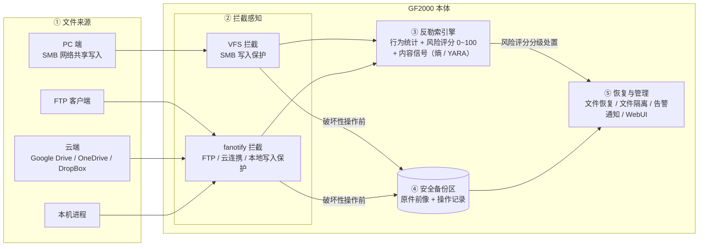

- 拦截感知层对异常批量改写、加密、重命名等行为进行检查；破坏性操作先备份原件再放行；
- 引擎按会话累计评分，依据评分分级处置（见 3.3）；
- 达到极危时自动拦截可疑行为、断开来源，并从备份区恢复文件。

### 3.3 防护流程与分级处置

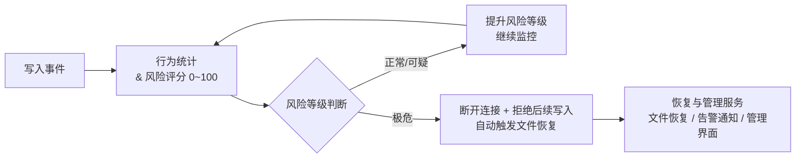

风险评分依据：① 批量覆盖写入　② 大量文件重命名（`.docx` → `.encrypted`）　③ 短时间大量删除　④ 跨目录扩散　⑤ 文件内容高度随机（加密特征）/ YARA 特征命中。

分级处置原则：

| 等级 | 处置 |
|---|---|
| 正常 | 继续监控 |
| 可疑 | 仅更新风险等级并记录，不打断业务 |
| 极危（CRITICAL） | 立即阻断该会话（断开连接 / 拒绝写入 / 终止进程）+ 自动从备份区恢复受影响文件 |

## 4. 架构目标和约束

### 4.1 目标

| 目标 | 当前实现手段 |
|---|---|
| 客户端透明 | SMB 通过 VFS 回调；FTP/云/本地通过 fanotify/inotify |
| 修改前可恢复 | SMB 破坏性操作前保存前像；fanotify 通道在权限事件中执行通道前置处理 |
| 多信号检测 | 操作频率、扩展名、目录扩散、熵、YARA 汇总到会话评分 |
| 快速阻断 | SMB 使用 blocked 文件和 `smbcontrol`；其他通道使用 FAN_DENY/进程或任务动作 |
| 事件级恢复 | `event_id` 关联前像、新建文件和恢复状态 |
| 本地部署 | 配置、规则、日志、数据库和前像均保存在设备本地 |

### 4.2 硬约束

| 约束 | 架构影响 |
|---|---|
| fanotify 依赖内核编译选项 | 需启用 `CONFIG_FANOTIFY` 和 `CONFIG_FANOTIFY_ACCESS_PERMISSIONS`（FAN_OPEN_PERM 应答能力）；Yocto 内核 defconfig 缺项时 `fanotify_init` 失败，FTP/云/本地三通道整体不可用 |
| FID 模式依赖内核版本和文件系统能力 | 要求内核 ≥ 5.1 且被监控文件系统支持 exportfs 文件句柄（ext4/xfs/btrfs 支持，tmpfs 等不支持）；不满足时 notify 通道路径重建失效 |
| permission 与 FID notification 能力不同 | 使用两个 fanotify fd；权限线程和通知处理分离 |
| fanotify permission 只支持 open / access 文件前触发 | unlink / rename 等场景下无法完成前像备份操作 |
| 单节点数据库实例 | 状态仅在本机 PostgreSQL 实例内一致，不支持多节点共享阻断状态 |
| 不做损坏判定与计数阻断| 数据模型不保存逐文件 damaged/corrupted/encrypted 状态；内容信号（熵/YARA）仅作会话级证据参与行为评分，阻断依据是会话行为评分越限，**不是损坏文件数量** |
| 单一行为维度不得单独触发阻断 | 任何单一计数维度（修改/重命名/删除/目录扩散）的加权贡献不得单独达到 CRITICAL；CRITICAL 必须由至少两个独立维度、或维度评分叠加定性证据（勒索扩展名）共同达到 |
| 保护范围限定用户共享数据 | 只监控对外导出的 SMB 共享及 FTP/云/本地监控目录；不保护操作系统及系统关键文件，监控路径配置必须排除系统目录 |

## 5. 用例视图

| 用例 | 当前代码路径 | 状态 |
|---|---|---|
| UC-1 前像备份 | VFS（gf_open / gf_truncate / gf_unlink / ...） / Fanotify（open）拦截文件操作事件 → `do_backup` → DGRAM 上报 | 已实现 |
| UC-2 同内容覆盖降噪 | `gf_close` 前像/当前文件哈希 → CONTENT_SAME → session 撤销 modified → scorer 限分 | 已实现 |
| UC-3 批量勒索行为阻断 | WRITE/RENAME/DELETE/目录扩散/扩展名/内容信号 → 会话评分 → CRITICAL | 已实现 |
| UC-4 FTP 文件事件检测 | fanotify 通道识别 vsftpd、归一化事件、权限拒绝及进程阻断 | 已实现 |
| UC-5 云联携扩散控制 | 识别云任务、使用独立长窗口、删除/禁用任务并记录配置 | 部分实现，依赖平台命令和配置 |
| UC-6 本地进程阻断 | `/proc` 身份解析、PID starttime 防复用、会话阻断后终止进程 | 已实现 |
| UC-7 自动恢复 | CRITICAL → fork → 延迟 exec `gfrguard-recover restore --event` | 已实现 |
| UC-8 配置/规则热重载 | SIGHUP 重读 JSON、同步 blocked、重建 marks、reload YARA | 已实现 |
| UC-9 邮件告警 | 事件进入邮件队列并定时汇总发送 | 规划 |
| UC-10 签名规则升级 | 校验离线/在线规则包并原子替换 | 规划 |

## 6. 逻辑视图

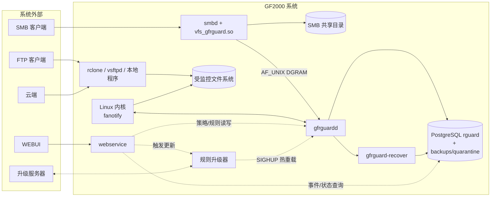

## 7. 实现视图

### 7.1 概述

实现模型分为三层——**拦截层**负责"看到"文件操作并保存前像，**策略层**负责判断这些操作是否构成勒索行为，**持久化与工具层**负责记录状态和执行恢复。分层的目的只有一个：让"如何拦截"（Samba/fanotify 的内核细节）与"是否恶意"（评分策略）互不感知，任一层的实现变化不波及其他层。

依赖方向自上而下，禁止反向依赖：

| 层 | 内容 | 加入规则与边界 |
|---|---|---|
| L1 拦截层 | VFS 回调、fanotify 双 fd 基础设施、FTP/Cloud/Local 通道 handler | 只做拦截、前像、身份解析和上报，**不做策略判断**；经定长协议进入策略层，不直接读写数据库 |
| L2 策略层 | process_msg 管线、session、scorer、entropy、YARA、blocker | 只依赖数据库客户端/YARA 库；不直接调用 Samba API，不感知内核接口细节 |
| L3 持久化与工具层 | PostgreSQL 持久化，文件恢复工具、规则升级工具 | 只依赖公共持久化格式和运行文件布局，不链接 daemon 内部模块 |

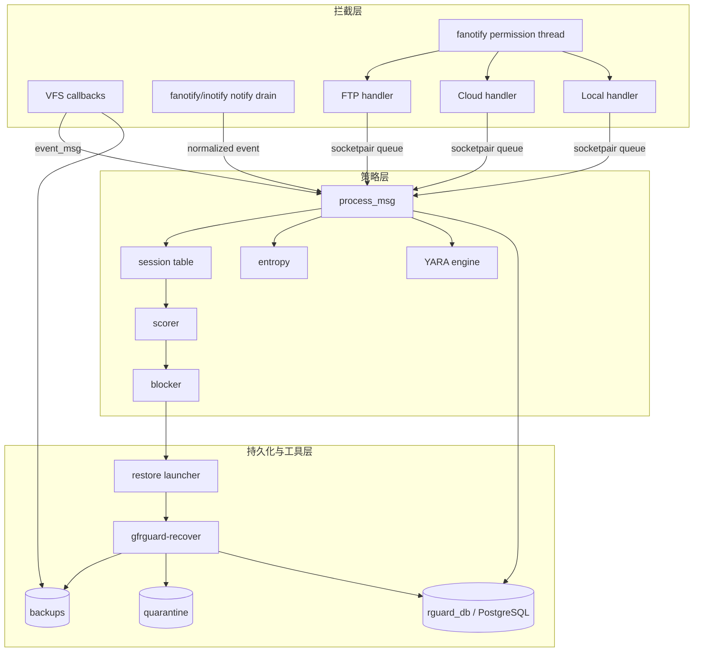

### 7.2 拦截层

拦截层完成三件事：在四类通道（SMB / FTP / 云联携 / 本地）上截获文件操作、对破坏性操作先保存前像（保证"修改前可恢复"）、把事件归一化后上报给策略层。它只忠实记录"谁对哪个文件做了什么"，**不判断好坏**——判定全部留给策略层。

#### 7.2.1 SMB VFS 模块

`vfs_gfrguard.so` 是 Samba 的插件，运行在每个 smbd 进程内。它的功能：让 SMB 客户端的每一次写、重命名、删除、建目录都先经过 GFRGuard——已存在的文件被破坏前先留一份前像，随后把事件通过 DGRAM 上报给 daemon。对已阻断的客户端则直接拒绝访问。

已注册回调：

| 回调 | 当前职责 |
|---|---|
| connect | 调用下一层、读取 share 参数、验证 store、初始化 DGRAM、检查 blocked |
| disconnect | 关闭 DGRAM 并调用下一层 |
| openat | 识别写模式、检查 blocked、对既有破坏性写创建前像、挂接 FSP 状态、上报事件 |
| pwrite | 处理 procfd 延迟前像、检查运行中阻断、避免重复上报 |
| ftruncate | 捕获 O_APPEND 后再 truncate 的绕过、补做前像 |
| renameat | 操作后上报源路径和目标名；扩展名分析由 daemon 完成 |
| unlinkat | 删除前创建前像，严格模式失败则拒绝删除 |
| mkdirat | 检查 blocked 并上报新建目录事件 |
| close | 对最多 64 MiB 的前像/当前文件做全量 FNV-1a 比对，上报 CLOSE |

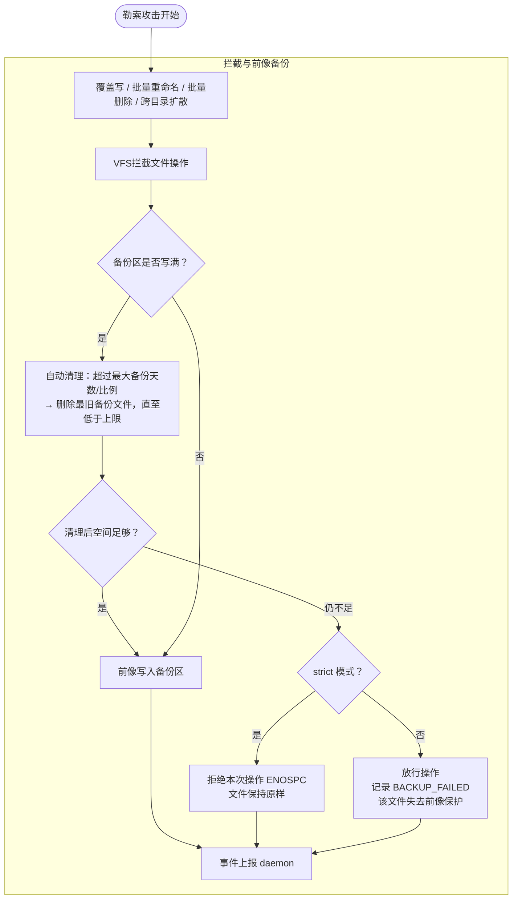

#### 7.2.2 fanotify通道

FTP、云联携、本地三类通道不经过 Samba，统一改用 Linux 内核的 fanotify 接口拦截。它提供两种能力：**permission 事件**让 daemon 能在文件被打开的瞬间同步决定放行或拒绝（这是这三类通道阻断勒索进程的手段）；**notification 事件**异步告知已发生的创建、修改、删除、重命名，用于事后检测与评分。两类事件能力不同（见 4.2），因此用两个独立的 fd 入口：

双事件入口：

| 入口 | 线程/循环 | 作用 |
|---|---|---|
| permission fd | 独立 pthread | 处理 `FAN_OPEN_PERM`，必须向内核回复 ALLOW/DENY |
| notification fd | daemon 主循环 drain | 处理 CLOSE_WRITE、MODIFY、CREATE、DELETE、MOVE 等异步事件 |
| socketpair | permission 线程 → 主线程 | 把归一化消息交给统一 `process_msg`，避免在线程中修改会话/数据库 |

通知归一化：

| 内核事件 | 归一化事件 | 关键标志/处理 |
|---|---|---|
| CREATE | OPEN | NEW_FILE |
| MODIFY | WRITE | 经 fangate 抑制同路径洪泛 |
| CLOSE_WRITE | CLOSE | 触发 daemon 内容信号分析 |
| DELETE | DELETE | 事后检测；内核无删除 permission 事件 |
| FAN_RENAME | RENAME | 解析 OLD_DFID_NAME 与 NEW_DFID_NAME；保留源路径、目标完整路径和目标名用于扩展名分析 |

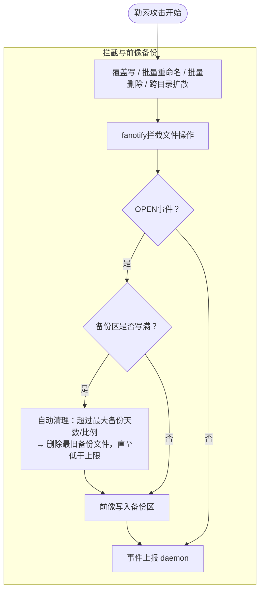

### 7.3 策略层

策略层完成一件事：回答"这个用户/进程的行为像不像勒索软件"。它接收拦截层上报的归一化事件，把同一来源（`username@client_ip`）在一段时间内的操作聚合为一个**会话**，在会话上累计行为计数（修改/重命名/删除/目录扩散），叠加内容信号（熵/YARA），算出风险分；分数越过 CRITICAL 阈值就阻断该会话并触发恢复。整个策略层运行在 daemon 主线程，不感知事件来自 SMB 还是 fanotify。

#### 7.3.1 主流程

主流程即 `process_msg`：所有通道的事件在这里汇成一条处理管线——先过滤（开关、黑白名单、例外），再归属会话、触发内容分析、更新滑动窗口并评分，最后按分数决定记录或阻断。

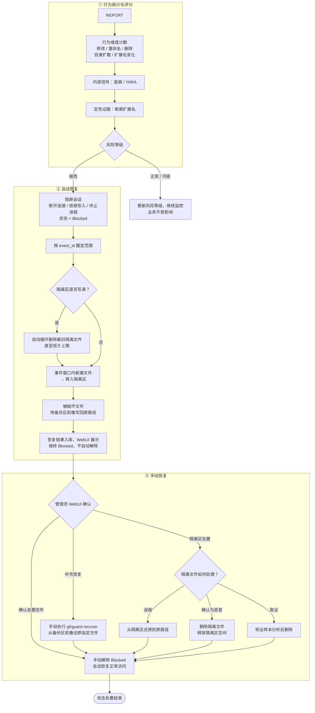

#### 7.3.2 会话状态

会话是行为检测的基本单位。单个文件操作无法区分"正常办公"和"勒索加密"——看的是**同一来源在一段时间内的操作模式**（短时间内大量修改 + 跨目录扩散 + 扩展名改变）。会话表就是为这个判断保存的滚动证据：每个 `username@client_ip` 一条记录，累计这段时间内它干了什么、风险到什么等级、是否已被阻断。

`session_table` 使用 1024 槽 FNV-1a 哈希和线性探测。会话保存：

- modified、rename、delete；
- touched_dirs（最多记录固定数量目录 hash）；
- ext_change、ransom_ext；
- high_entropy、yara_match；
- content_same；
- event_id、risk_score、risk_level、is_blocked 和时间窗口。

短窗口重置操作计数，长窗口重置目录集合、事件 ID 和风险等级，但阻断状态不自动清除。Cloud 使用更长的独立窗口。

#### 7.3.3 评分模型

评分模型把会话里的各类证据折算成一个 0–100 的风险分，再按阈值映射到**正常 / 可疑 / 极危**三级（低于最低阈值不评级，视为正常）。规则分两类：**加分项**决定基础分，**封顶/清零修正**压制误报。计算顺序固定：先求加权和，再依次应用修正规则，最后按阈值定级。

**① 加分项（加权求和）**

$$
S = m w_m+r w_r+d w_d+t w_t+e w_e+x w_x+\sigma_h w_h+\sigma_y w_y
$$

| 类别 | 证据 | 计入方式 |
|---|---|---|
| 行为维度 | 修改 $m$、重命名 $r$、删除 $d$、目录扩散 $t$、扩展名变化 $e$ | 按会话内命中次数 × 各自权重累计；同时是单维度封顶判定的 dims |
| 定性证据 | 勒索扩展名 $x$ | 按次数累计加分；不在 dims 内，但解除单维度封顶 |
| 内容信号 | 高熵 $\sigma_h$、YARA 命中 $\sigma_y$，均 $\in \{0,1\}$ | 会话级布尔：首次命中置位、只加一次固定权重，不按命中文件数累计。只加分，不参与 dims、不解除封顶 |

权重 $w_*$ 全部来自策略配置，不写死在代码里。默认权重及设计依据：

| 权重项 | 默认值 | 依据 |
|---|---:|---|
| 修改 $w_m$ | 3 | 单文件改写是最弱证据（正常办公高频），必须靠量级积累才可疑 |
| 重命名 $w_r$ | 4 | 勒索加密后通常伴随改名，略强于单纯修改 |
| 删除 $w_d$ | 3 | 与修改同档 |
| 目录扩散 $w_t$ | 5 | 跨目录扩散是批量攻击区别于单文件误操作的最强行为特征 |
| 扩展名变化 $w_e$ | 5 | 正常办公极少批量改扩展名，与目录扩散同档 |
| 勒索扩展名 $w_x$ | 30 | 命中已知勒索扩展名接近定性证据，命中即越过 normal(30) |
| 高熵 $w_h$ | 8 | 压缩包/媒体文件天然高熵，误报面大，权重保守且每会话只加一次 |
| YARA $w_y$ | 40 | 已知勒索样本特征，单信号强度最高；但 40 < critical(80)，命中后仍需行为计数配合才能到极危，且同样受单维度封顶约束——避免"一条 YARA 规则误报即全线阻断" |

默认阈值：warn 30 / high 60 / critical 80；窗口 10s / 30s（云连携 60s / 180s）；熵阈值 Shannon 7.0。

**② 封顶/清零修正（按序应用）**

| 规则 | 条件 | 效果 |
|---|---|---|
| 同内容降噪 | CONTENT_SAME 占写活动 ≥ 80% | 分数清零 |
| 同内容降噪 | CONTENT_SAME 占写活动 ≥ 50% | 封顶到 warn 阈值以下 |
| 纯删除保护 | 会话只有删除计数、无任何写/改名/扩展名/内容信号 | 封顶 60（配置校验须保证 critical > 60，否则仍可达 CRITICAL） |
| 单维度封顶 | 仅一种非零行为计数，且无定性证据 | 封顶到 critical 阈值以下；出现第二维度或勒索扩展名即解除。批量加密天然伴随目录扩散（$t>0$），不受此限 |

**评分后处理**

1.总分 clamp 到 0–100；
2.0-30分：正常，30-80分：可疑，80-100分：极危
3.等级到动作的映射全通道一致：正常 / 可疑 更新等级，不打断业务；极危（Critical）才触发 blocker 阻断 + fork 延迟恢复**（动作内容按通道差异化，见 7.4.1）。

**通道间的一致性**

所有通道使用**同一个 scorer、同一套权重和阈值**——评分规则不因来源不同而改变。差异只在三处：

| 差异点 | 说明 |
|---|---|
| 统计窗口 | 云连携通道使用独立的更长窗口（默认短 60s / 长 180s），因为云同步事件受 API 限速、到达慢，全局短窗口会在积累到阻断分数前就把计数清零；其余通道用全局窗口 |
| CONTENT_SAME | 只有 SMB 通道有前像可比对，同内容降噪规则实际只对 SMB 生效；fanotify 通道该计数恒为 0，规则自然不触发 |

#### 7.3.4 内容信号的实际触发

内容信号回答"文件内容本身像不像被加密/是已知勒索样本"，作为行为评分之外的定性证据。三种信号在不同通道、不同时机触发，本节给出完整对照：

| 信号 | SMB | FTP/Cloud/Host | 执行位置 |
|---|---|---|---|
| CONTENT_SAME | tracked file CLOSE，最大 64 MiB 全量比较 | 无前像比较 | smbd worker，同步 |
| HIGH_ENTROPY | OPEN/WRITE/TRUNCATE | CREATE/MODIFY | daemon 主线程，同步采样前 8 KiB |
| YARA_MATCH | CLOSE | CLOSE_WRITE | daemon 主线程，同步扫描 |

熵与 YARA 都是会话级布尔信号：会话首次命中后，该会话后续文件**不再执行对应扫描**

### 7.4 持久化与工具层

这一层解决"阻断之后怎么办"和"状态记在哪"：阻断动作的执行、被破坏文件的恢复、YARA 规则的升级、以及所有事件与前像索引的落盘。

#### 7.4.1 阻断与恢复

阻断与恢复是本系统的最终目的：确认勒索行为后，**先止损**（切断该会话的访问能力），**再还原**（把被破坏的文件用前像写回原路径、把勒索新建的文件隔离）。

阻断动作由策略层 blocker 执行，恢复由工具层 `gfrguard-recover` 完成。

会话风险等级共三级：**正常 / 可疑 / 极危**（低于 warn 阈值不评级），阈值来自策略配置；Blocked 是独立于等级的阻断状态。越过 warn/high 阈值只改变风险等级，不产生动作；到达极危才进入阻断流程。业务时序：

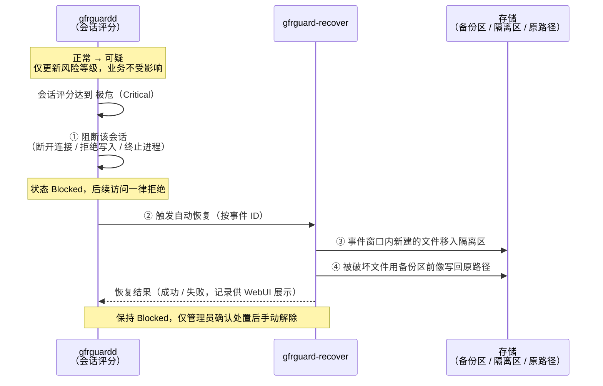

要点：阻断先于恢复，确保破坏停止后再还原；恢复范围由事件 ID 圈定——该事件保护过的文件还原、新建的文件隔离，不依赖逐文件损坏判定；阻断不随恢复自动解除，避免恢复期间同一来源再次写入。

一个已知的粒度边界：SMB 阻断动作会断开整个共享连接，同共享上的无关会话可能被一并断开，随后按来源 IP 精确放行。

#### 7.4.2 规则升级

规则升级完成的功能：让全部**检测资产**随新勒索家族出现而整体更新——校验签名后原子替换，daemon 热重载生效，整个过程不中断检测。

升级包是全量资产包，包含三类资产，缺一不可：

| 资产 | 部署位置 | 更新理由 |
|---|---|---|
| YARA 规则 | `yara-rules/` 目录 | 新勒索家族的已知样本特征 |
| 勒索扩展名清单 | `ransom_extensions_config` 指向的文件 | 新家族的新扩展名，直接决定 $w_x$ 证据的覆盖面 |
| 评分权重与阈值 | scoring 配置 | 权重/阈值随攻击手法演进调优；与扩展名清单同源发布可避免"新证据配旧权重"的错配 |

规划时序：

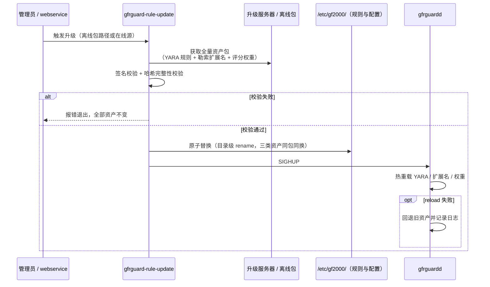

设计决策：三类资产**同包发布、同时生效**，保证检测证据与评分参数永远配套；复用既有 SIGHUP 热重载通道，不新增 IPC；目录级 rename 保证 daemon 任意时刻要么看到完整旧资产、要么看到完整新资产；reload 失败回退旧资产，升级事故不影响检测主路径，符合故障放行原则。

#### 7.4.3 PostgreSQL 持久化

PostgreSQL（平台既有实例中的独立 database）承担系统状态的唯一可信来源：每次风险事件、每个被保护文件与其前像的对应关系、恢复进度，都记录在此——恢复工具据此知道"该还原哪些文件"，webservice 据此向管理员展示事件详情。

表结构见 9.1，本节只说明所有权与一致性边界：

- **写入者唯一**：`events` / `protected_files` / `created_files` / `cloud_task_configs` 的业务写入全部在 daemon 主线程；recover 只更新恢复状态字段；webservice 只读查询。三方各自建立连接，不共享连接。
- **跨层非原子**：前像文件创建（L1 VFS）与 `protected_files` 入库（L2 daemon）不是一个事务——进程在两者之间崩溃会产生无索引的磁盘前像；空间管理定时任务负责收敛（见 10.2）。
- **schema 兼容**：用 `ALTER TABLE` 补充历史列做就地迁移，新旧版本 daemon / recover 可混跑。
- **单机语义**：本机 PostgreSQL 实例保证事务一致，不支持多节点共享阻断状态（见 4.2 硬约束）。

#### 7.4.4 备份区与隔离区

备份区与隔离区存放的是系统里最敏感的两类数据：前像是攻击者最想删掉的东西，隔离样本不能再流出。本节回答三个问题：容量怎么封顶、写入开销怎么最小、如何防止勒索进程回头破坏备份、样本二次扩散。

**初始化**

gfrguardd 启动时探测 XFS Project Quota 能力，二选一初始化存储，随后**汇合到同一挂载点**——后续所有前像/隔离写入代码不知道、也不需要知道底层是哪一种。备份区与隔离区是**两个独立配额区域**（备份区默认 100 GB、隔离区默认 50 GB）：隔离样本的增长不能挤占前像空间，反之亦然。

| 探测结果 | 初始化动作 | 容量封顶机制 |
|---|---|---|
| 支持 Project Quota | 创建 `/data/.rguard/{backups,quarantine}`，两个目录分别设置 project quota 硬上限（默认 100 GB / 50 GB），`mount --bind` 进 daemon 挂载命名空间 | 内核 quota 按 project 分别强制，写满返回 EDQUOT |
| 不支持 | 创建 `/data/backup.img` 与 `/data/quarantine.img`，分别 `fallocate` 物理预占（默认 100 GB / 50 GB），格式化为 XFS 后 `mount -o loop` | 镜像文件固定大小，天然封顶 |

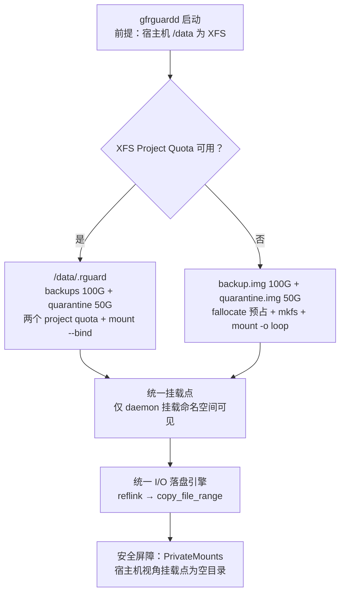

**统一I/O落盘引擎**

前像复制的开销直接加在客户端写路径上（见 10.3），落盘必须走最快路径：

1. 优先 `reflink`（FICLONE）——XFS 原生支持，微秒级零拷贝，仅当源文件与前像同盘时可用，这是备份区必须建在 `/data` 同卷上的原因；
2. 失败降级 `copy_file_range()`——内核页缓存内搬运，不出内核态；
3. 最终兜底 `read/write` 循环（与 10.3 的三级降级一致）。

两条初始化路径在这一层彻底无差别：quota 还是 loop 只决定容量封顶方式，不影响复制代码。

**安全屏障：PrivateMounts**

挂载通过 systemd `PrivateMounts` 完成（daemon 在独立 mount namespace 中挂载存储）：**宿主机全局命名空间里，挂载点始终是空目录**。

## 8. 进程视图

进程与线程关系：

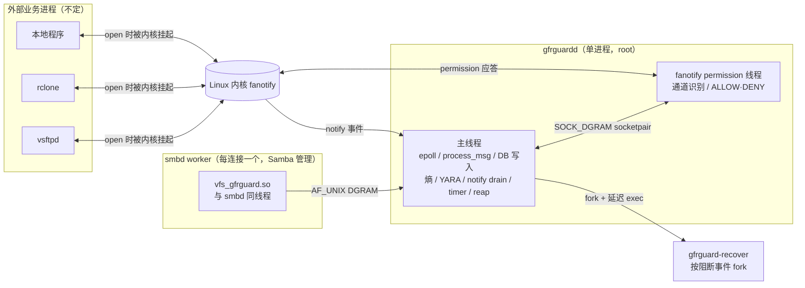

## 9. 数据视图

### 9.1 PostgreSQL

当前 schema 包含：

| 表 | 所有者 | 用途 |
|---|---|---|
| events | daemon | 会话事件、峰值风险、动作和状态 |
| protected_files | daemon/recover | 原路径、前像路径、元数据、操作类型和恢复状态 |
| created_files | daemon/recover | 事件窗口中新建路径，恢复时清理 |
| cloud_task_configs | cloud/recover | 被阻断云任务的配置和恢复状态 |

数据流向总览：

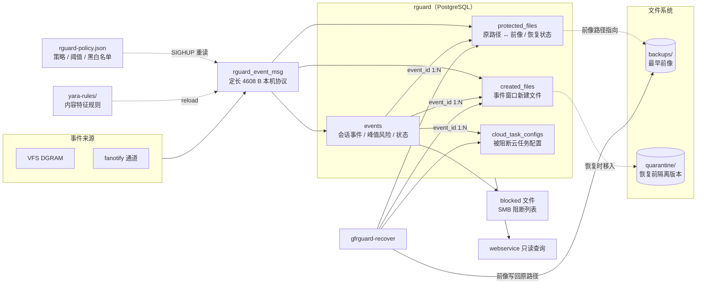

### 9.2 文件布局

| 路径 | 内容 |
|---|---|
| `/etc/gf2000/rguard-policy.json` | daemon 策略 |
| `/etc/gf2000/yara-rules/` | YARA 规则目录 |
| `/etc/gf2000/ransom-extensions.json` | 勒索扩展名规则 |
| `/etc/gf2000/rguard-scoring.json` | 勒索打分规则 |
| `<store>/backups/<share>/<relative>` | 最早前像 |
| `<store>/quarantine/<event>/...` | 恢复前隔离的当前版本 |
| `/run/gfrguardd/gfrguardd.sock` | VFS 事件 DGRAM |
| `/run/gfrguardd/blocked` | SMB IP 阻断列表 |
| `/var/log/gfrguard/gfrguard.log` | 结构化事件日志 |

## 10. 大小和性能

### 10.1 内存占用

GF2000 是 NAS 设备，内存占用必须可预期——与受保护数据的规模**无关**，只随配置上限变化。

| 资源 | 占用 | 说明 |
|---|---|---|
| daemon 常驻内存 | **约 2.3 MB 固定上限**（会话表 1024 槽 × 约 2.3 KB）+ 进程本体（350 KB）+ YARA 规则编译产物 | 会话表预分配、不随文件数量增长 |
| VFS 模块 | 70 KB .so 加载进每个 smbd，每连接状态仅 FSP 挂接的少量字段 | 无进程级堆分配 |
| recover 子进程 | 按阻断事件 fork，短生命周期 | 不常驻 |

影响架构的内存/协议硬上限：

| 尺寸 | 值 | 架构影响 |
|---|---|---|
| 事件消息 | 定长 4608 B（文件路径上限 4096 B） | 无变长解析；超长路径事件无法表达，只能丢弃 |
| 会话表 | 1024 桶哈希 + 线性探测 | 会话数有硬上限；洪泛下新会话可能无法建立 |
| 目录扩散集合 | 每会话最多 256 个目录 hash | 超上限的扩散行为不再计入评分 |
| CLOSE 内容比较 | ≤ 64 MiB 全量 FNV-1a | 大文件不做 CONTENT_SAME 降噪，按修改计分 |
| 熵采样 | 文件头 8 KiB | 只覆盖文件开头；尾部加密的文件可能漏检 |

### 10.2 磁盘占用与边界

| 资源 | 占用 | 说明 |
|---|---|---|
| 程序磁盘 | 三个二进制合计约 0.5 MB；YARA 规则、策略 JSON 为 KB 级 | 可忽略 |
| 状态磁盘 | PostgreSQL 只记事件与文件索引，行级增长 | 有硬上限：仅保留最近 10000 条 / 30 天事件，超出部分每日归档为 CSV（见 10.2.3） |
| 前像与隔离区 | **系统唯一的磁盘大头** | 备份区默认100GB，隔离区默认50GB |

#### 10.2.1 单文件前像大小限制

超大文件的前像复制会同步阻塞客户端写路径（见 10.3），且单个大文件即可吃掉可观的前像配额。设计引入单文件前像大小上限：

- 默认**不限制**——保护完整性优先，任何文件都可恢复
- 可选档位：**100 MB / 200 MB / 500 MB / 1 GB / 2 GB / 5 GB**
- 超限文件发生破坏性操作时：跳过前像创建，事件照常上报、照常参与评分，并记录事件供 WebUI 展示"该文件不受前像保护"
- 与 CLOSE 内容比较 64 MiB 上限取向一致：开启限制后，超大文件既不享受 CONTENT_SAME 降噪、也不享受前像保护——大文件防护降级为"只检测、不恢复"

#### 10.2.2 备份区/隔离区写满后的处置

| 对比项 | AppCheck | Kaspersky | GFRGuard |
| --- | --- | --- | --- |
| 备份区容量控制 | 支持配置最大备份天数 / 最大备份size，达到上限后自动清理 | 支持配置最大备份天数 / 最大备份size，达到上限后自动清理 | 支持配置最大备份天数 / 最大备份比例，达到上限后自动清理 |
| 备份区超上限处理 | 删除最旧备份文件，直至低于容量上限 | 删除最旧备份文件，直至低于容量上限 | 删除最旧备份文件，直至低于容量上限 |
| 隔离区容量控制 | - | 支持配置最大隔离size | 自动循环删除 |
| 隔离区超上限处理 | - | 删除最旧隔离文件，直至低于容量上限 | 删除最旧隔离文件，直至低于容量上限 |

#### 10.2.3 数据库事件存储上限与 CSV 归档

事件表不能无限增长——PostgreSQL 是平台共享实例，GFRGuard 不能成为平台的存储负担。保留策略：**数据库只保留最近 10000 条、且不超过 30 天的事件**；每日归档任务将超出保留窗口的事件导出为 CSV，随后从库中删除。

每日归档按当日事件量分三种场景：

| 场景 | CSV 输出 | 系统日志 |
|---|---|---|
| 当日无事件 | 不生成 CSV | 1 条：当日无事件，跳过归档 |
| 当日事件 ≤ 10000 | 1 个 CSV | 2 条：已处理事件数 / 未处理事件数 |
| 当日事件 > 10000 | 多个 CSV，每个最多 10000 条 | 每个 CSV 各 2 条：已处理 / 未处理事件数 |

### 10.3 性能约束

目标部署形态为**小规模公司（数十客户端量级）**。总体结论：GFRGuard 对业务 I/O 的实质影响集中在前像复制；事件洪泛时损失的只是检测覆盖率，不是业务吞吐——客户端速度不受 GFRGuard 限制。

| 路径 / 场景 | 性能约束 | 手段 | 小规模场景下的实际影响 |
|---|---|---|---|
| SMB 前像复制（破坏性写） | 与客户端写操作同步完成 | reflink → copy_file_range → read/write 三级降级（见 7.4.4） | 业务 I/O 的唯一实质开销；reflink 下接近零拷贝 |
| 事件上报（VFS → daemon） | 不得阻塞 smbd | AF_UNIX DGRAM fire-and-forget，EAGAIN 有限重试后丢弃 | 微秒级开销；洪泛超限丢事件，损失检测覆盖率而非业务吞吐 |
| fanotify permission 应答（含前像备份） | 应答时延 = 业务进程 open 被内核挂起的时间；`FAN_OPEN_PERM` 无法区分读写意图（见 7.2.2），对每次 open 先同步执行首拷备份再应答 | 独立线程；first-copy-wins（O_EXCL 去重）；reflink → copy_file_range → read/write 降级；禁止无界内容扫描；故障优先放行 | FTP/云/本地每次 open 增加一次备份检查时延：reflink 下微秒级；降级为整文件拷贝时与文件大小成正比——单文件前像上限（见 10.2.1）同时是该时延的硬封顶 |
| daemon 主循环 | YARA / CLOSE 哈希 / DB 写入均在主线程 | 已知吞吐瓶颈；慢操作推迟所有通道处理（见 7.3） | 决定事件处理吞吐上限；不反向限制客户端 |
| 首次数据导入（批量拷入历史数据） | 部署后最常见的高负载时刻 | 新建文件不产生前像复制；CONTENT_SAME 降噪 + 延迟评分（等 CLOSE 再算分）防误报阻断 | 基本无感：同步路径仅多一次 blocked 缓存检查 + 一次 DGRAM 上报 |
