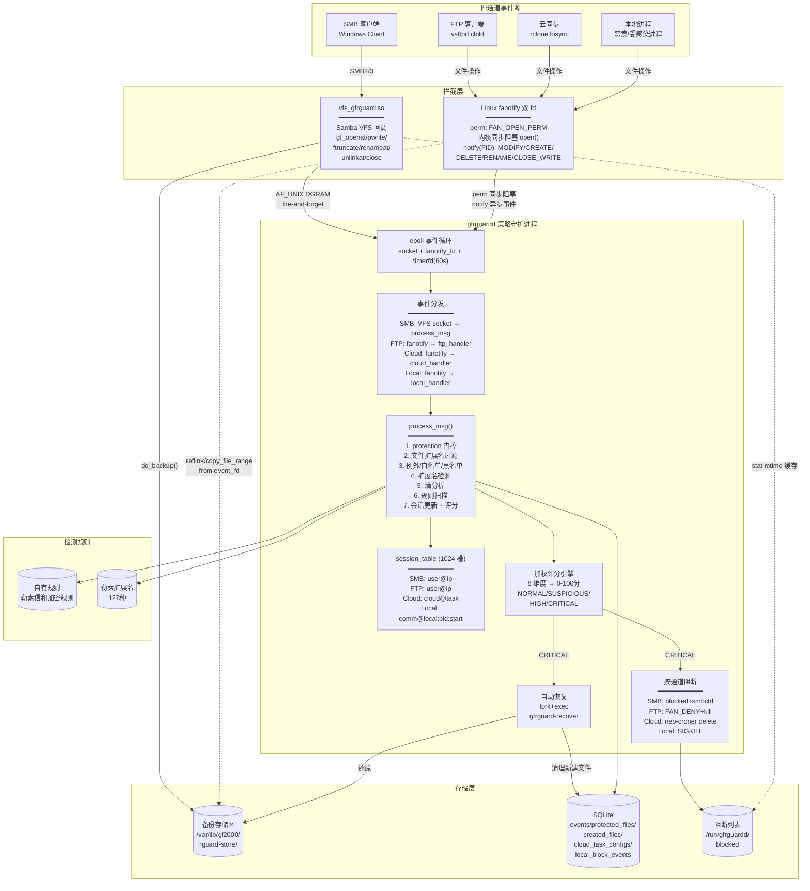
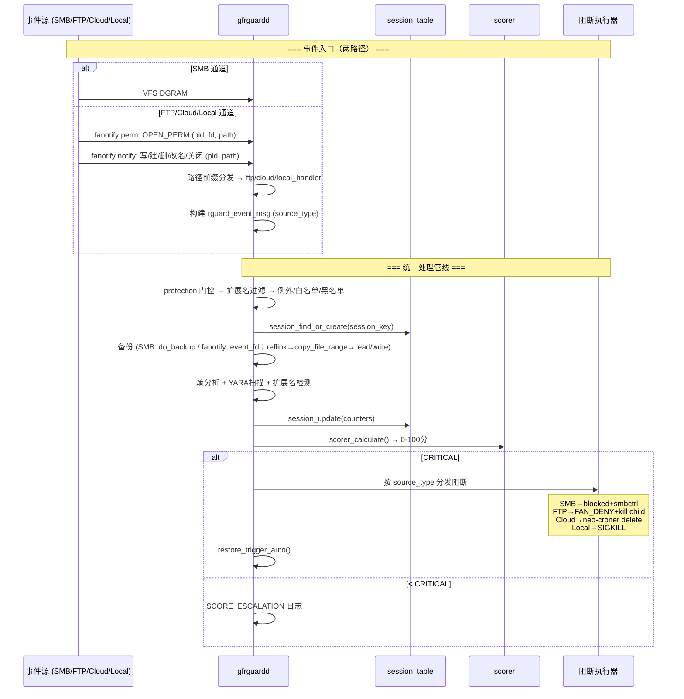

# GF2000 APPCHECK 详细设计文档

## 1. 概述

### 1.1. 设计目标

构建一套覆盖 **SMB / FTP / 云连携 / 本地** 四通道的 NAS 反勒索防护系统。核心设计目标：

- **透明拦截**：SMB 通道通过 VFS 回调拦截；FTP/云连携/本地通道通过 fanotify 双 fd（FAN_OPEN_PERM 同步阻塞 open + notify 异步检测写/建/删/改名/关闭）
- **多层检测**：内容层（Shannon 熵 + YARA）+ 行为层（8 维度加权评分）+ 信誉层（黑名单）
- **可恢复**：首次写入前自动备份（reflink CoW 克隆优先，copy_file_range 零拷贝回退），阻断后自动恢复
- **可配置**：JSON 分层配置 + SIGHUP 热重载，四通道独立子开关
- **零破坏**：所有错误透明回退（VFS → NEXT；fanotify → 内核自动 FAN_ALLOW）

### 1.2. 背景

参见需求规格说明书（FR-VFS-01 至 FR-LOCAL-03）

### 1.3. 范围

| 模块 | 说明 |
|------|------|
| VFS 反勒索模块 (`vfs_gfrguard.so`) | SMB 文件操作拦截、备份、内容比对、事件上报 |
| 策略守护进程 (`gfrguardd`) | 四通道事件接收 (socket + fanotify)、会话追踪、熵/YARA、评分、阻断、恢复 |
| FTP 反勒索模块 | fanotify 双 fd（perm 拦截 + notify 检测）+ /proc/PID/cmdline 上下文关联 |
| 云连携反勒索模块 | fanotify 双 fd + rclone cmdline 解析 + neo-croner 任务阻断/恢复 |
| 本地反勒索模块 | fanotify 双 fd + PID/comm 粒度 + SIGKILL，含进程名白名单 |
| 配置系统 | JSON + SIGHUP 热重载 + fanotify mark 管理 |
| IPC 协议 | SMB: 4608 字节 DGRAM；FTP/Cloud/Local: fanotify 事件 fd |

---

## 2. 总体设计

### 2.1. 模块定位

```
                          ┌─────────────────────────┐
                          │     gfrguard-recover     │
                          │    (文件恢复工具，已实现)  │
                          │  restore / unblock /     │
                          │  cloud-restore           │
                          └───────────┬─────────────┘
                                      │ exec (auto/cloud-restore)
                                      ▼
┌──────────────────┐      ┌──────────────────────────────────────────┐
│  vfs_gfrguard.so │      │              gfrguardd                    │
│  (SMB 通道)       │      │         (策略守护进程)                     │
│                  │ IPC  │                                          │
│  • gf_openat     │DGRAM▶│  ┌──────────┐  ┌──────────┐             │
│  • gf_pwrite     │      │  │VFS socket│  │fanotify×2│             │
│  • gf_ftruncate  │      │  └────┬─────┘  └────┬─────┘             │
│  • gf_renameat   │      │       │              │                   │
│  • gf_unlinkat   │      │       ▼              ▼                   │
│  • gf_mkdirat    │      │  ┌────────────────────────────┐         │
│  • gf_close      │      │  │     process_msg()           │         │
│  • do_backup()   │      │  │  共享评分 + 按通道阻断       │         │
│  • is_blocked()  │      │  └────────────────────────────┘         │
└──────────────────┘      │                                          │
                          │  ┌──────────┐ ┌──────────┐ ┌─────────┐ │
┌──────────────────┐      │  │SMB blocker│ │fanotify   │ │restore  │ │
│  fanotify 通道    │      │  │blocked   │ │handlers   │ │engine   │ │
│  ─────────────── │      │  │+smbctrl  │ │           │ │         │ │
│  FTP / 云连携    │─────▶│  └──────────┘ └─────┬─────┘ └─────────┘ │
│  / 本地进程       │perm +  │                    │                   │
│  同步拦截 open    │notify  │         ┌──────────┼──────────┐        │
│  异步检测：写/建/  │双 fd   │         ▼          ▼          ▼        │
│  删/改名/关闭     │        │  ┌──────────────────────────────┐     │
└──────────────────┘        │  │  session_table (1024 槽)       │     │
                            │  │  SMB/FTP: user@ip             │     │
┌──────────────────┐        │  │  Cloud:   cloud@<task>        │     │
│  rguard-policy   │        │  │  Local:   comm@local:pid:start│     │
│  .json (统一配置) │        │  └──────────────────────────────┘     │
└──────────────────┘        └──────────────────────────────────────────┘
```

**关键设计约束**：
- VFS 模块以 smbd worker 进程为粒度加载
- 守护进程单进程 epoll 事件驱动 (socket + fanotify_fd + timerfd)
- fanotify 三通道共用同一对 fd（perm fd 同步拦截 open + notify fd 异步检测写/建/删/改名/关闭；FAN_CLASS_CONTENT 组一个进程只能创建一个）
- fanotify 事件按路径前缀分发：Cloud → FTP → Local（精确匹配优先）
- session key 全通道统一格式 `username@client_ip`，由公共骨架（rguard_make_session_key）在 resolve 后统一推导；通道只填 username/client_ip 字段，通道间靠字段内容天然隔离 + source_type 路由

### 2.2. 架构图



### 2.3. 核心流程

#### 2.3.1. 四通道统一事件处理



#### 2.3.2. fanotify 事件分发流程

```
fanotify event (pid, fd, path)
  │
  ├─ path 前缀匹配 cloud_sync.tasks[].local_path?
  │   └─ YES → cloud_handler() → 解析 rclone cmdline → 骨架推导 session_key="cloud@<task>"
  │
  ├─ path 前缀匹配 ftp.monitor_paths?
  │   └─ YES → ftp_handler() → /proc/PID 解析 → 骨架推导 session_key="user@ip"（解析失败回退 "ftp@unknown"）
  │
  ├─ path 前缀匹配 local.monitor_paths?
  │   └─ YES → local_handler() → /proc/PID/stat → 白名单检查 → 骨架推导 session_key="<comm>@local:<pid>:<starttime>"
  │
  └─ 不匹配任何 → FAN_ALLOW (非监控路径，直接放行)
```

---

## 3. 详细设计

### 3.1. VFS 反勒索模块（SMB 通道）

VFS 模块（`src/vfs/vfs_gfrguard.c`）在 smbd worker 进程内运行，注册 9 个 VFS 回调。

| 回调 | 函数 | 核心职责 |
|------|------|---------|
| `connect` | `gf_connect` | 加载 smb.conf、校验备份目录、init_daemon_socket（仅 protect=true）、blocked 检查 |
| `disconnect` | `gf_disconnect` | 关闭 socket fd |
| `openat` | `gf_openat` | 写入类型识别（排除 O_APPEND）→ 对破坏性写创建前像 → VFS_ADD_FSP_EXTENSION；新建文件追踪 (NEW_FILE + RANSOM_EXT FSP) |
| `pwrite` | `gf_pwrite` | 延迟备份（/proc 路径推迟到 pwrite 阶段路径解析）；blocked 检查 |
| `ftruncate` | `gf_ftruncate` | 延迟备份；untracked ftruncate 处理（O_APPEND 绕过防御） |
| `renameat` | `gf_renameat` | 发送原始 src/dst 路径；条件编译兼容新旧 VFS 接口 |
| `unlinkat` | `gf_unlinkat` | 删除前备份 |
| `mkdirat` | `gf_mkdirat` | 追踪新建目录 |
| `close` | `gf_close` | 上报文件关闭事件（供行为计数），FNV-1a 内容比对（备份 vs 当前 → CONTENT_SAME） |

**关键数据结构**：`gfrguard_config`（每连接）+ `rguard_file_state`（每文件，通过 VFS_ADD_FSP_EXTENSION）

**固定前像保护**（First-write Backup）：对受保护用户共享中的既有文件，一旦发生覆盖写（O_WRONLY|O_TRUNC）或 truncate 等破坏性写入，统一创建修改前的副本（不依据文件重要性、进程恶意性或会话风险分选择是否备份）。do_backup() 优先 reflink（FICLONE CoW 克隆，同文件系统且支持 reflink 时秒级完成）→ copy_file_range 内核零拷贝 → read/write 逐级回退（共享 rguard_backup.h）；ctime 去重（30s 窗口）；O_EXCL 竞争保护。

保护范围仅限配置指定的用户共享，OS 关键目录（如 `/boot /etc /bin /sbin /lib /usr` 等）明确不纳入。

### 3.2. 策略守护进程（通用引擎）

守护进程（`src/daemon/gfrguardd_main.c`）以 systemd 服务运行，单进程 epoll 事件驱动。

#### 3.2.1. 组件表

| 组件 | 源文件 | 职责 |
|------|--------|------|
| 主循环 | `gfrguardd_main.c` | epoll(socket + fanotify_fd + timerfd) + 信号 + 配置热重载 |
| 会话管理 | `gfrguardd_session.c/h` | 1024 槽哈希表，统一格式 session_key(username@client_ip)，双窗口(10s/30s) |
| 评分引擎 | `gfrguardd_scorer.c/h` | 8 维度加权求和，3 级阈值，特殊规则 |
| 阻断执行 | `gfrguardd_blocker.c/h` | blocked 文件 + smbcontrol（SMB）；供 fanotify handler 调用 |
| 自动恢复 | `gfrguardd_restore.c/h` | fork + exec gfrguard-recover，WNOHANG 回收 |
| 空间管理 | `gfrguardd_space.c/h` | statvfs 检查，超阈值清理 |
| 熵分析 | `gfrguardd_entropy.c/h` | Shannon 熵，前 8KB 采样 |
| 配置 | `../common/rguard_config.c/h` | JSON 解析，默认值填充，hash 预计算，校验 |
| **fanotify 通道** | | |
| fanotify 基础框架 | `gfrguardd_fanotify.c/h` | fanotify_init / mark 管理 / epoll 集成 / 路径前缀分发 / 备份 / 事件构建 / process_msg 提交 |
| FTP handler | `gfrguardd_ftp.c/h` | fanotify 事件处理，/proc/PID/cmdline 解析（虚拟用户兼容）+ socket-inode 兜底 |
| Cloud handler | `gfrguardd_cloud.c/h` | fanotify 事件处理，rclone cmdline 解析 → task_name，neo-croner 任务管理 |
| Local handler | `gfrguardd_local.c/h` | fanotify 事件处理，/proc/PID/stat → comm+starttime，PID 复用保护，SIGKILL |

#### 3.2.2. 事件处理管线 (process_msg)

```text
接收事件 (SMB via DGRAM / fanotify via handler 构建)
  │
  ├─[1] protection.enabled? ─── 否 → PROTECTION_OFF
  ├─[2] source_type 子开关路由 ─── 否 → PROTECTION_OFF
  ├─[3] file_extensions 过滤 ─── 不在范围 → EXT_FILTER_SKIP
  ├─[4] scorer_is_excepted() ─── 命中 → EXCEPTION_BYPASS
  ├─[5] scorer_is_whitelisted() ─── 命中 → WHITELIST_BYPASS
  ├─[6] scorer_is_blacklisted() ─── 命中 → 立即阻断
  │
  ├─[7] 生成 event_id → 写 events 表
  ├─[8] BACKED_UP? → 写 protected_files 表
  ├─[9] 扩展名检测 (RENAME: src vs dst; NEW_FILE: 扩展名匹配)
  ├─[10] 熵分析 (entropy_enabled && BACKED_UP && OPEN/WRITE/TRUNCATE)
  ├─[11] 规则扫描
  │
  ├─[12] session_update(counters) + scorer_calculate()
  │
  └─[13] 风险等级判定
        ├─ NORMAL → 继续
        ├─ SUSPICIOUS/HIGH → SCORE_ESCALATION 日志
        └─ CRITICAL → 按 source_type 执行阻断:
              SMB:  blocker_execute() + add_to_blacklist() + restore_trigger_auto()
              FTP:  FAN_DENY + kill(SIGTERM) + blocker_execute()
              云连携: FAN_DENY + neo-croner delete + kill 进程树 + 保存配置到DB
              本地:   FAN_DENY + SIGKILL + 写 local_block_events
```

#### 3.2.3. 会话状态管理

1024 槽 FNV-1a 哈希表 + 线性探测。session_key 全通道统一格式 `username@client_ip`，由公共骨架（fan_channel_handle / process_msg → rguard_make_session_key）在 resolve 后统一推导，通道只填充 username / client_ip 字段：

| 通道 | session_key 格式 | 示例 | PID 复用保护 |
|------|-----------------|------|-------------|
| SMB | `user@ip` | `alice@192.168.1.100` | 不需要（Samba 会话生命周期） |
| FTP | `user@ip`，解析失败回退 `ftp@unknown` | `alice@10.0.0.5` | 不需要（vsftpd child 短生命周期） |
| 云连携 | `cloud@<task_name>`（client_ip 字段携带 task_name） | `cloud@onedrive_1` | 不需要（以 task 为粒度） |
| 本地 | `<comm>@local:<pid>:<starttime>`（client_ip 字段携带进程实例标识） | `bash@local:54321:1882234` | /proc/PID/stat starttime 校验 |

双窗口机制：短窗口(10s)重置操作计数器，长窗口(30s)重置会话整体状态 + event_id；云连携通道按 source_type 使用独立窗口（默认 60s/180s）。

#### 3.2.4. 加权评分引擎

8 维度加权求和 (0-100)，三级阈值 (warn=30/high=60/critical=80)。维度包括：modified（写操作次数）、rename、delete、touched_dirs、ext_change（扩展名变化）、行为风险信号（内容检测的加权分，与操作维度同级，不独立计数）。**评分以文件操作行为指标为主，不以"损坏文件数"或"加密文件数"驱动阻断**。

**特殊规则**：Content-Same 比例抑制 (≥80%→score=0，≥50%→cap=warn-1)、纯删除上限 (≤60)。

**通道适配**：
- 云同步：独立评分窗口 `scoring.cloud_sync.window_short/window_long`（默认 60s/180s）——云事件按 API 节奏到达（每 10s 常仅 1-5 个文件），沿用全局 10s 窗口会让慢速同步攻击永远积累不到阻断线
- 本地：随机 comm 检测 (+20)、多 PID 协同检测 (≥3 → critical)

#### 3.2.5. 内容信号分析

- **熵分析**：前 8KB Shannon 熵，阈值 7.0。文件仅采样一次（首次收到该文件的写事件时），后续对该文件的写入不再重复计算
- **内容规则**：与熵同一时机采样，规则集递归加载 + 容错编译，10s 超时，首条命中报告后该会话中止后续检测

#### 3.2.6. 阻断与恢复（四通道汇总）

| 通道 | 阻断机制 | 恢复机制 | 互通性 |
|------|---------|---------|--------|
| **SMB** | blocker_execute() → blocked 文件 + smbcontrol close-share | gfrguard-recover restore --event <id> --auto | blocked 文件对 SMB+FTP 共享 |
| **FTP** | FAN_DENY + kill(SIGTERM) vsftpd child + blocker_execute() | 同 SMB | 与 SMB 共享 blocked 文件 |
| **云连携** | FAN_DENY + neo-croner delete --task-name + kill 进程树 | gfrguard-recover cloud-restore --task-name | 独立阻断 |
| **本地** | FAN_DENY + SIGKILL | gfrguard-recover restore | 独立阻断，审计表记录 |

### 3.3. fanotify 公共抽象层

FTP / Cloud / Local 三个通道共用 `gfrguardd_fanotify` 模块的**双 fanotify fd**：

| fd | class | 事件 | 处理线程 |
|----|-------|------|---------|
| `g_fan_fd` | `FAN_CLASS_CONTENT` | `FAN_OPEN_PERM`（同步拦截 + 备份） | 独立 perm 线程 |
| `g_fan_notify_fd` | `FAN_CLASS_NOTIF \| FAN_REPORT_DFID_NAME` | `CLOSE_WRITE / MODIFY / CREATE / DELETE / RENAME` | 主线程 epoll |

perm fd **禁止**加任何 `FAN_REPORT_*` 标志（内核拒绝 CONTENT + FID 组合）；notify fd 的 dirent 事件（CREATE/DELETE/RENAME）依赖 FID group（内核 ≥5.9，低版本自动降级为仅 CLOSE_WRITE）。FID 事件不携带 fd，路径通过「父目录 file handle → `open_by_handle_at`（按 fsid 匹配通道 mount_fd）→ `/proc/self/fd` readlink + 文件名拼接」重建。

**事件覆盖（与 VFS 通道对齐）**：

| fanotify 事件 | op_type | flags | 对应 VFS 回调 |
|--------------|---------|-------|--------------|
| FAN_OPEN_PERM | OPEN | RISKY(+BACKED_UP) | gf_openat（拦截+备份） |
| FAN_MODIFY | WRITE | RISKY | gf_pwrite / gf_ftruncate（truncate 走 ATTR_SIZE→FS_MODIFY） |
| FAN_CREATE | OPEN | NEW_FILE | gf_openat O_CREAT / gf_mkdirat |
| FAN_DELETE | DELETE | — | gf_unlinkat |
| FAN_RENAME | RENAME | —（配对时填 new_name） | gf_renameat |
| FAN_CLOSE_WRITE | CLOSE | — | gf_close |

**洪泛门（fangate）**：解决 fanotify 通道的"单文件事件放大"误报问题。评分规则是"10 秒内改写的文件越多分越高"（约 27 次改写即 CRITICAL 阻断），SMB 通道由 VFS 保证每个文件只报一次；但 fanotify 事件是内核裸发的——每次 open 一条 OPEN_PERM、每写一批数据一条 MODIFY，**通过 FTP 正常上传一个大文件就可能产生几百条事件**，不加控制会把一次正常上传误判成勒索攻击。洪泛门用一张小哈希表记住"这个会话在本窗口内已为这个文件计过分"：10 秒内同一 (会话, 文件) 的重复 RISKY 事件只算第一条，后续吞掉。**检测能力不受影响**——勒索软件的特征是横扫大量*不同*文件，门只压掉"反复写同一个文件"这种正常业务形态。三个边界：备份与黑名单拦截**不过门**（安全动作永不抑制）；CLOSE 事件不过门；哈希碰撞 fail-open（宁可多算一分，绝不漏报）。

**自事件过滤**：`meta->pid == getpid()` 的 notify 事件直接丢弃（备份/恢复回写不进评分管线）。

**fanotify 固有限制（与 VFS 通道的不可对齐项）**：
1. delete/rename/mkdir 无 perm 事件 → 只能事后检测 + SIGKILL/block，无法像 VFS 一样事前 EACCES 拒绝；
2. unlink 不经过 open → 无删除前备份，仅有 open 时备份的历史副本可恢复；
3. OPEN_PERM 不可见 open flags → 无法区分读/写打开，保守地对每次 open 备份。

| 功能 | 说明 |
|------|------|
| `fanotify_module_init(ep)` | 创建双 fanotify fd + 加入 epoll（FID 不支持时降级） |
| `fanotify_channel_setup(ch)` | 注册通道（mark_path + handler）→ 激活（realpath/mount_fd/fsid/树遍历） |
| `fanotify_retry_pending_channels()` | 60s 定时器重试挂起通道 |
| `fanotify_mark_tree_add(dir)` | nftw 递归打 mark（双 fd） |
| `fanotify_poll()` | FID 解析 → 路径重建 → 新目录补 mark → 前缀最长匹配分发 |
| `fanotify_gate_allow(skey, path)` | 洪泛门：同一 (会话, 文件) 10 秒内重复的改写事件只计一次分，防大文件写入误判（见上文"洪泛门"） |
| `fanotify_do_backup(fd, path)` | 从 fanotify event_fd 备份：reflink → copy_file_range → read/write（rguard_backup.h） |
| `fanotify_build_event_msg()` / `fanotify_fill_notify_msg()` | 构建消息 / notify 事件到 op_type+flags+new_name 的统一映射 |
| `fanotify_submit_event(msg, skey)` | 提交到 `process_msg()` 统一管线 → 返回 blocked 状态 |
| `fanotify_set_daemon_ctx()` | 注入 daemon 上下文（db/sessions/policy/seq/anchor） |

**事件分发**：路径前缀最长匹配（按 realpath 归一化），`/srv/ftp` → FTP handler，`/data/onedrive` → Cloud handler，`/home` → Local handler。

**配置**：`monitor_path: { ftp: [], cloud_sync: [], local: [] }` —— 纯路径数组，fanotify mark 的最小必需信息。

### 3.4. FTP 反勒索模块（fanotify 通道）

**会话识别**（三级策略，按优先级）：
1. **首选**：`/proc/PID/cmdline` — vsftpd 将进程标题改写为 `vsftpd: <ip>/<user>: <action>`（ip/user 分隔符为 `/`；未登录态为 `vsftpd: <ip>: connected`，无用户名则落兜底）。需开启 `setproctitle_enable=YES`（**默认 OFF**），一次读取同时获取真实 IP 和用户名（含虚拟用户）；标题空间 = 原 argv+env 大小，可能被截断，解析器须容忍
2. **兜底 IP**：`/proc/PID/fd/` → socket inode → 先匹配 `/proc/PID/net/tcp`，再匹配 `/proc/net/tcp`（vsftpd ≥3.0 默认 `isolate_network=YES`，worker 被 CLONE_NEWNET 进空 netns，连接 socket 仍登记在监听进程所在 netns，即 daemon 所在 netns）
3. **兜底 User**：`/proc/PID/status` → UID → getpwuid

`session_key` = `user@ip`（骨架统一推导）；三级解析全部失败时回退 `ftp@unknown`（不阻断、仍计入评分）。

**事件处理**：
- **perm** 分支：黑名单命中 → FAN_DENY + SIGKILL；其余同通用模式（备份→洪泛门→队列转主线程）
- **notify** 分支：经 `fanotify_fill_notify_msg` 统一映射后提交评分（CLOSE_WRITE 即 YARA入口，MODIFY/DELETE/RANAME 参与行为评分）

**阻断与恢复**：评分 CRITICAL 时 FAN_DENY + SIGTERM vsftpd child + `blocker_execute()`（写 blocked 文件，与 SMB 通道互通）；恢复同 SMB（gfrguard-recover restore）。

### 3.5. 云连携反勒索模块（fanotify 通道）

**会话识别**：解析 rclone 进程 `/proc/PID/cmdline`，找 `remote:path` 格式参数，`:` 前部分 = task_name。`session_key` = `cloud@<task_name>`（与 process_msg 的 username@client_ip 派生一致）。用户映射由 `cloud_resolve_user(task_name)` 提供——当前为 mock（固定返回 "cloud"），待 neo-croner query 或配置 DB 补全。

**事件处理**：
- **perm** 分支：同通用模式（备份→洪泛门→队列转主线程），不含黑名单（云通道无黑名单概念）
- **notify** 分支：经 `fanotify_fill_notify_msg` 统一映射后提交评分（CLOSE_WRITE 即 YARA/熵入口，MODIFY/DELETE/RENAME 参与行为评分）
- rclone 临时文件（`.partial~/.tmp/.rclone-tmp`）在 perm 与 notify 两类事件中均排除
- 独占配置：评分窗口可覆盖为 `scoring.cloud_sync.window_short/window_long`（默认 60s/180s），适配云 API 事件节奏——洪泛门窗口跟随通道窗口

**阻断与恢复**：评分 CRITICAL 时 neo-croner delete --task-name + kill 进程树 + 任务配置存库（DB 表 `cloud_task_configs`）以备恢复；阻断独立于 SMB/FTP（不写 blocked 文件）。恢复：`gfrguard-recover cloud-restore --task-name <NAME>`（文件还原 + neo-croner add 重注册）。

### 3.6. 本地反勒索模块（fanotify 通道）

**会话识别**：`session_key` = `<comm>@local:<pid>:<starttime>`（统一 `username@client_ip` 格式：comm 填 username 字段，`local:<pid>:<starttime>` 填 client_ip 字段），通过 `/proc/PID/stat` 提取 comm 和 starttime 防 PID 复用；进程名白名单（smbd / systemd / sshd / rclone / vsftpd / gfrguardd 等内置列表，当前不可配置）→ FAN_ALLOW 直接放行，不做备份和评分。

**事件处理**：
- **perm** 分支：黑名单（按 comm）命中 → FAN_DENY + SIGKILL；其余同通用模式（备份→洪泛门→队列转主线程）
- **notify** 分支：经 `fanotify_fill_notify_msg` 统一映射后提交评分（CLOSE_WRITE 即 YARA入口，MODIFY/DELETE/RENAME 参与行为评分）

**阻断与恢复**：评分 CRITICAL 时 FAN_DENY + SIGKILL，审计写入 `local_block_events` 表（含 comm/cmdline/exe_path）。恢复同 SMB（gfrguard-recover restore）。溯源：`events.pname` 记录实进程名，仅本地通道填写。

### 3.7. 配置系统

#### 3.7.1. 配置结构（rguard-policy.json，与 rguard_config.c 实际解析一致）

```text
store_path / log_path / log_level / mode(strict|permissive)
scoring_config / ransom_extensions_config        # 外部文件路径（评分参数 / 勒索扩展名库）
protection { enabled, smb, cloud_sync, ftp, host }
monitor_path { ftp[], cloud_sync[], local[] }    # fanotify 监控路径，每通道最多 8 条
scoring {
  window_short, window_long                      # 全局评分窗口（默认 10s/30s）
  cloud_sync { window_short, window_long }       # 云通道独立窗口（默认 60s/180s，适配云 API 事件节奏）
  weights { modified, rename, delete, dirs, ext_change, ransom_ext, high_entropy, yara_match }
  thresholds { warn, high, critical }            # 默认 30/60/80，须严格递增
  entropy_threshold / entropy_enabled / yara_enabled
}
whitelist { users[], ips[] }                     # IP 支持 CIDR 与范围
blacklist { users[], ips[{ip, auto_add}] }       # auto_add=true 为 daemon 自动加入项（内存另有 FIFO 运行时列表，上限 64）；auto 判决即时以 {ip, auto_add:true} 对象形式持久化进 ips[]，重载/重启不丢，仅管理员显式删除可解除；前端按 auto_add 区分手动/自动显示
exceptions { files[], folders[] }
file_extensions { all, manual[] }
space { max_usage_percent, cleanup_days }
auto_restore { enabled, delay_seconds }
```

说明：所有参数均有默认值，最小配置仅需 `store_path` + 监控路径（FR-CONFIG-01）；`scoring` 优先读 `scoring_config` 外部文件，缺失时回退内联 `scoring` 对象；勒索扩展名同理（`ransom_extensions_config` / 内联 `ransom_extensions`）。本地进程白名单为内置列表（gfrguardd_local.c），当前不可配置。

#### 3.7.2. 热重载

| 变更 | 触发 |
|------|------|
| smb.conf | smbcontrol smbd reload-config |
| 策略/评分/扩展名/FTP/Cloud/Local 配置 | SIGHUP → config_load 全量重读（`daemon_reload()`） |
| fanotify marks | SIGHUP → 停 perm 线程 → FLUSH 双 fd + 清 channel → 按新 policy 重跑三通道 module_init（递归树遍历）→ 重启 perm 线程；停/启窗口内 perm 事件在内核排队不丢失 |
| blocked 文件 | SIGHUP → blocker_sync_blacklist 完整重建 |
| auto 黑名单 | auto add = 一次局部 reload，三副本同步：内存 auto 列表（FIFO 64）+ rguard-policy.json（`{"ip","auto_add":true}` 对象，tmp+rename 原子写，同上限淘汰最旧）+ blocked 文件（blocker_sync_blacklist 全量重建，淘汰项随之移除）；SIGHUP 由 carry-over 兜底保留运行时条目（去重 manual）；重启后从 json 重新加载，不丢判决 |

### 3.8. IPC 与事件源

#### 3.8.1. SMB 通道

```
Offset  Size   Field        说明
──────  ─────  ───────────  ──────────────────────────
0       1      msg_type     1=FILE_EVENT
1       1      op_type      1=OPEN,2=WRITE,3=TRUNCATE,4=RENAME,5=DELETE,6=CLOSE
2       2      flags        9 个标志位
4       8      timestamp    Unix 时间戳
...
224     4096   file_path    文件绝对路径（RGUARD_PATH_MAX，与 Linux PATH_MAX 一致）
4320    256    new_name     rename 目标名
4576    1      source_type  RGUARD_SOURCE_SMB(1)/CLOUD_SYNC(2)/FTP(3)/HOST(4)
4577    31     _reserved    预留扩展
──────  ─────  ───────────  ──────────────────────────
Total: 4608 bytes, pack(1)
```

**标志位**：0-2,4-5 由 VFS 设置；3,6-8 由 daemon 在 process_msg() 中追加。

**布局即契约**：vfs_gfrguard.so 与 gfrguardd 必须同步构建部署——接收端丢弃长度不匹配的数据报，版本错配表现为事件静默丢失。项目内所有文件路径缓冲区统一使用 `RGUARD_PATH_MAX`(4096)。

#### 3.8.2. fanotify 通道：内核事件

perm fd 事件结构 `fanotify_event_metadata` 含 pid / fd / mask，路径由 `/proc/self/fd/<fd>` 解析；notify fd（FID group）事件携带父目录 file handle + 文件名（`FAN_EVENT_INFO_TYPE_DFID_NAME` 记录），路径由 `open_by_handle_at` 重建，事件 fd 恒为 `FAN_NOFD`。

fanotify handler 内部构建 `rguard_event_msg`（source_type = FTP/CLOUD_SYNC/HOST），notify 事件经 `fanotify_fill_notify_msg()` 统一映射 op_type/flags/new_name 后传给 process_msg()。

### 3.9. 数据库设计

SQLite (`<store_path>/index.db`)：

| 表 | 用途 | 通道 |
|----|------|------|
| `events` | 事件记录 (event_id, session_key, username, client_ip, **pname**, started_at, action_taken, status, peak_risk_score) —— pname 仅 local 通道填写 | 全部 |
| `protected_files` | 被保护文件 (event_id, original_path, backup_path, share_name, username, client_ip, inode, mtime, file_size, file_uid/gid/mode, op_type, protected_at, restore_status) | 全部 |
| `created_files` | 新建文件 (event_id, file_path, share_name, username, client_ip, created_at) —— 恢复时清理 | 全部 |
| `cloud_task_configs` | 云同步任务配置 (event_id, task_name, expression, command, status, disabled_at, restored_at) —— 阻断时保存，恢复时读取 | 云连携 |
| `local_block_events` | 本地阻断审计 (event_id, pid, comm, cmdline, exe_path, risk_score, block_action, blocked_at) | 本地 |

---

## 4. 关键非功能性设计

### 4.1. 错误处理

| 层 | 错误场景 | 行为 |
|----|---------|------|
| VFS | 备份失败 / IPC 失败 / blocked 读取失败 | 透明回退到 SMB_VFS_NEXT_* |
| fanotify | daemon 崩溃 / handler 错误 | 内核自动 FAN_ALLOW 所有待处理事件，不挂死业务进程 |
| daemon | 规则初始化失败 | 不阻止启动，扫描静默跳过 |
| daemon | JSON 解析/校验失败 | 使用默认值 / 保留当前配置 |
| 备份 | reflink 失败（fs 不支持/跨 FS） | 回退 copy_file_range；再失败回退 read/write，EXDEV 自动处理 |

### 4.2. 日志

| 事件 | 级别 | 通道 | 说明 |
|------|------|------|------|
| CONFIG_LOADED | INFO | 全部 | 启动/SIGHUP |
| MSG_RECV | DEBUG | SMB | VFS 事件 |
| BACKUP_SUCCESS / BACKUP_FAILED | INFO/ERROR | 全部 | |
| RISK_HIT | INFO | 全部 | |
| EXT_FILTER_SKIP / EXCEPTION_BYPASS / WHITELIST_BYPASS | DEBUG | 全部 | |
| BLACKLIST_BLOCK | WARN | SMB/FTP | |
| HIGH_ENTROPY / YARA_MATCH | WARN | 全部 | |
| SCORE_ESCALATION / BLOCK_EXECUTED / BLOCK_FAILED | WARN/ERROR | 全部 | |
| **CLOUD_BLOCK_EXECUTED** | WARN | 云连携 | neo-croner 删除 + 进程终止 |
| **CLOUD_RESTORE_COMPLETED** | INFO | 云连携 | 任务恢复 |
| **LOCAL_BLOCK_STOP / LOCAL_BLOCK_KILL** | WARN | 本地 | 进程暂停/终止 |
| AUTO_RESTORE_COMPLETED | INFO | 全部 | |

### 4.3. 安全

| 攻击面 | 缓解 |
|--------|------|
| 大量假事件淹没 daemon | SMB: 4MB socket buffer；fanotify: 内核排队 + epoll |
| 恶意 JSON 配置注入 | 严格校验（阈值递增、mode 合法性、路径可写性） |
| 符号链接攻击 | O_EXCL 创建备份，不跟随符号链接 |
| 备份存储区写满 | 60s 定时 space_check + max_usage_percent 阈值 |
| smbd worker 并发竞争 | O_EXCL 竞争保护 |
| PID 复用 (FTP/Local) | /proc/PID/stat starttime + comm 验证 + 30s 延迟清理 |
| ftp 匿名用户混同 | IP 区分（session_key = ftp@1.2.3.4） |
| 系统进程误杀 (Local) | whitelist_comm 白名单 |
| fanotify daemon 崩溃 | 内核自动 FAN_ALLOW，不阻塞业务 |

### 4.4. 性能

| 优化点 | 方法 | 通道 |
|--------|------|------|
| 备份 I/O | reflink CoW 秒级克隆优先（同 fs 且支持 reflink），copy_file_range 零拷贝回退 | 全部 |
| 内容比对 | FNV-1a 64-bit hash 流式 | 全部 |
| 阻断检查 | stat() mtime 纳秒缓存 | SMB |
| 匹配查找 | FNV-1a hash → 排序 → 二分查找 | 全部 |
| 熵分析 | 仅采样前 8KB | 全部 |
| fanotify 分发 | 路径前缀匹配 O(1) | FTP/Cloud/Local |
| PID 表 | FNV-1a 哈希表 O(1) | FTP/Local |
| 会话查找 | FNV-1a 哈希表 O(1) | 全部 |

---

## 5. 风险与待办

### 5.1. 潜在风险

| 风险 | 影响 | 缓解 | 优先级 |
|------|------|------|--------|
| 评分阈值未在生产环境校准 | 误报率可能高于预期 | 数据驱动调优；content-same 抑制；通道独立阈值 | 高 |
| 大文件备份延迟 | GB 级文件阻塞 open | reflink 时 O(1) 消除；回退路径 copy_file_range + 1MiB 块循环 | 中 |

### 5.2. 待决策项

1. **评分权重校准**：需在实际业务环境进行数据驱动的调优
2. **告警通知机制**：邮件告警 暂未实现